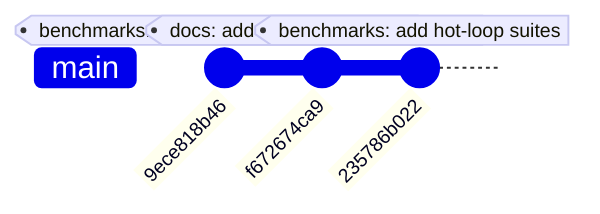
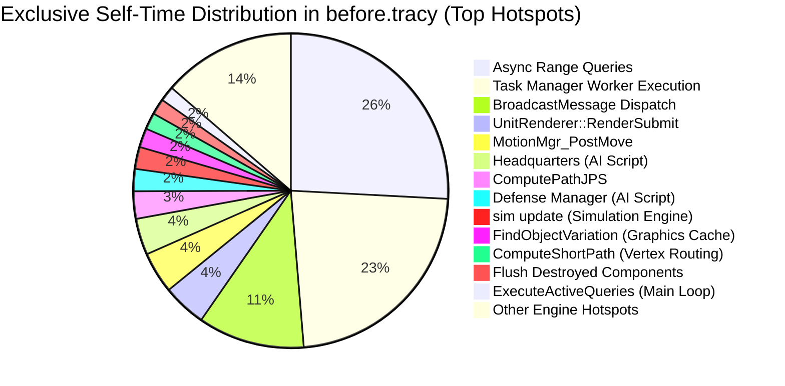
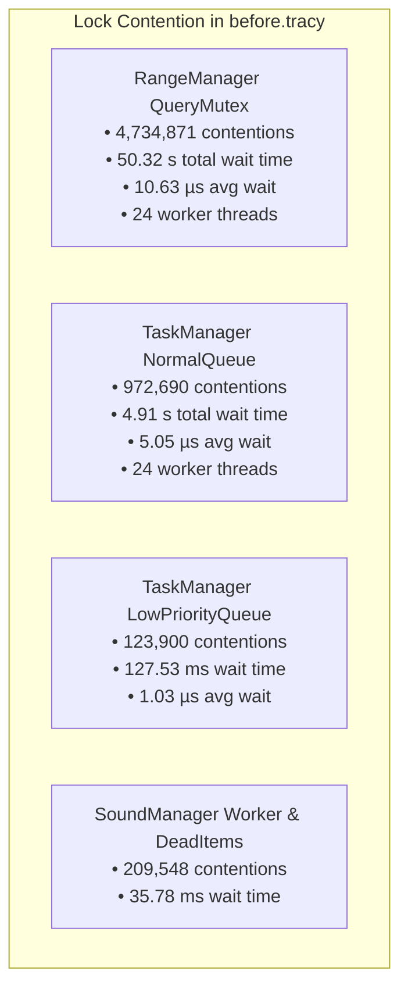
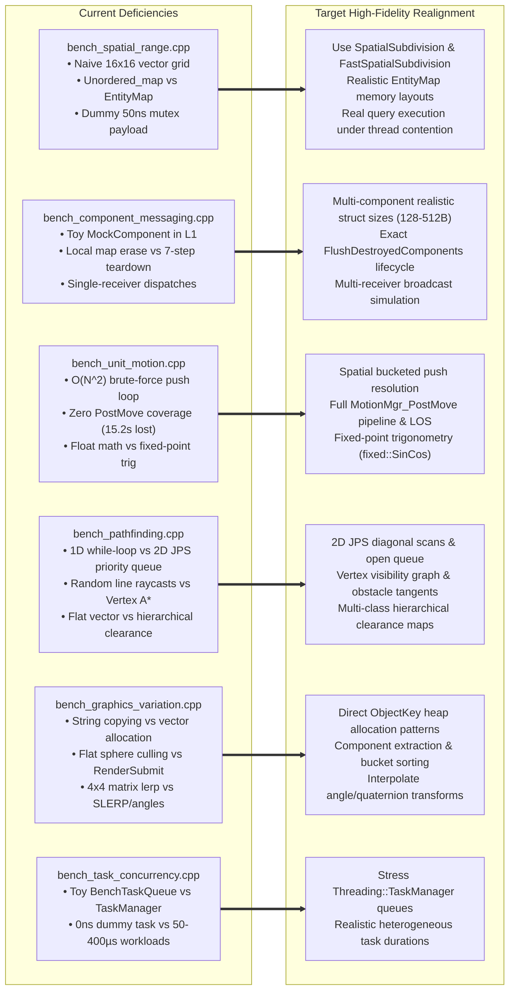
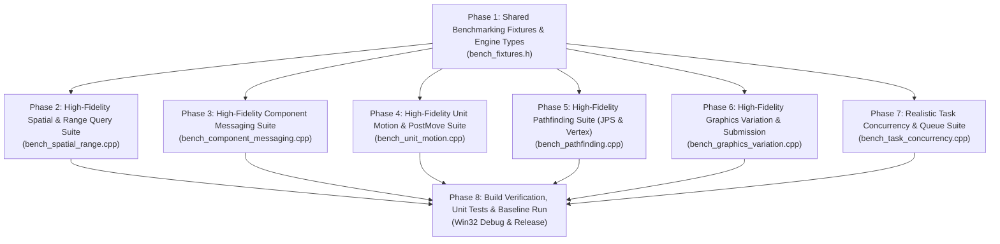

# Plan: Realigning Google Benchmark Suites with `before.tracy` Bottlenecks

## Executive Summary

This document presents a comprehensive evaluation of the changes introduced from commit `9ece818b46` onward, delivers an empirical analysis of the performance bottlenecks recorded in the Tracy profiling capture `before.tracy`, identifies the critical fidelity gaps and deficiencies in the current benchmark suites, and defines a phased, atomic roadmap for realigning the benchmark suites to faithfully reproduce the hot loops and concurrency bottlenecks observed in the real engine.

The profiling capture recorded **255.41 seconds** of continuous gameplay on a 24-core host machine spanning **5,455 graphics frames** and **11,302 simulation turns**, exposing severe CPU time sinks in spatial queries, message broadcasting, unit motion, pathfinding, and multi-thread lock contention.

> [!IMPORTANT]
> **Review & Approval Protocol**: In accordance with project governance rules, this plan **must be formally reviewed and approved by the user before any changes are submitted/committed**. Once approved, each phase will be enacted atomically, verifying Win32 Debug/Release builds and unit test suite passing status at every step.

---

## Evaluation of Changes (`9ece818b46b40669262c983a54462befd0e7e2ea` Onward)

Three commits have landed on the `tracy-and-entt` branch from `9ece818b46` onward:

### 1. Commit `9ece818b46` — Benchmark Banner and Type Conversions
- **Scope**: Minor cleanups in `source/benchmarks/bench_main.cpp` and `source/benchmarks/bench_synthetic.cpp`.
- **Assessment**: Fixed type truncation warnings by explicitly casting benchmark range parameters to `size_t` and verified engine fixed-point string conversion via `CFixed::ToString()`. Provided initial sanity validation of the Google Benchmark harness.

### 2. Commit `f672674ca9` — Hot-Loop Benchmark Implementation Plan
- **Scope**: Added `docs/hot_loop_benchmarking_plan.md`.
- **Assessment**: Outlined the preliminary blueprint for benchmark suites based on high-level zone timings from `before.tracy`. Established the modular structure under `source/benchmarks/`.

### 3. Commit `235786b022` — Initial Benchmark Suites Implementation
- **Scope**: Added 7 new files (1,478 lines of code) implementing benchmark suites for spatial queries, component messaging, pathfinding, unit motion, graphics variation, and task concurrency.
- **Assessment**: Successfully bootstrapped the benchmark executable target. However, as detailed in Section 4, the initial implementation relied heavily on **isolated synthetic mocks**, **toy data structures** (e.g., naive 16x16 vector grids instead of `SpatialSubdivision`), **brute-force $O(N^2)$ algorithms** (which invert actual engine asymptotic behavior), and **artificial micro-payloads** that fail to stress the CPU cache hierarchy or reproduce thread lock contention patterns recorded in `before.tracy`.

---

## Empirical Bottleneck Analysis of `before.tracy`

### 1. Profile Telemetry Overview
- **Duration**: 255.41 s (255,408,187,570 ns)
- **Host Hardware**: 24 logical CPU cores
- **Graphics Frames**: 5,455 frames | Avg: **48.03 ms** (~20.8 FPS) | Min: 0.80 ms | Max: 6,402.16 ms
- **Simulation Turns**: 11,302 turns | Avg: **15.34 ms** | Min: ~1.2 ms | Max: 474.35 ms
- **Total Zone Executions**: 8,058,430 instrumented zones
- **Total Lock Contention Events**: Over **6.08 million** lock contentions totaling **55.4 seconds** of blocked thread time.

---

### 2. Top Engine Hotspots Ranked by Exclusive Self-Time

| Rank | Zone Name | Subsystem / Function | Invocations | Exclusive Self-Time | Total Inclusive Time | Avg Duration |
|:---:|---|---|:---:|:---:|:---:|:---:|
| 1 | `Async range query execution` | `CCmpRangeManager::ExecuteActiveQueries` | 271,248 | **92,586.91 ms** (36.2%) | 92,586.91 ms | 341.34 µs |
| 2 | `Task Execution` | `Threading::WorkerThread::RunUntilDeath` | 425,190 | **81,903.44 ms** (32.1%) | 111,031.71 ms | 261.13 µs |
| 3 | `BroadcastMessage` | `CComponentManager::BroadcastMessage` | 72,771 | **39,255.34 ms** (15.4%) | 108,101.33 ms | 1,485.50 µs |
| 4 | `frame` (Main Loop) | `Frame` | 5,452 | **19,737.52 ms** (7.7%) | 253,409.98 ms | 46.48 ms |
| 5 | `UnitRenderer::RenderSubmit` | `CCmpUnitRenderer::RenderSubmit` | 11,530 | **16,075.67 ms** (6.3%) | 16,303.63 ms | 1,414.02 µs |
| 6 | `MotionMgr_PostMove` | `CCmpUnitMotionManager::Move` | 22,604 | **15,242.34 ms** (6.0%) | 17,824.97 ms | 788.58 µs |
| 7 | `Shared ApplyEntitiesDelta` | Script Interface (SpiderMonkey) | 11,302 | **14,679.07 ms** (5.7%) | 14,679.07 ms | 1,298.80 µs |
| 8 | `onUpdate` | Script Interface (SpiderMonkey) | 11,302 | **14,289.90 ms** (5.6%) | 14,289.90 ms | 1,264.37 µs |
| 9 | `Headquarters update` | Script Interface (AI HQ) | 2,828 | **13,424.02 ms** (5.3%) | 23,094.98 ms | 8,166.54 µs |
| 10 | `ComputePathJPS` | `LongPathfinder::ComputeJPSPath` | 111,661 | **10,103.33 ms** (3.9%) | 12,424.91 ms | 111.27 µs |
| 11 | `Defense Manager` | Script Interface (AI Defense) | 2,828 | **8,187.97 ms** (3.2%) | 8,187.97 ms | 2,895.32 µs |
| 12 | `sim update` | `CSimulation2Impl::Update` | 11,302 | **8,117.49 ms** (3.2%) | 173,345.99 ms | 15.34 ms |
| 13 | `FindObjectVariation` | `CObjectManager::FindObjectVariation` | 508,340 | **7,007.86 ms** (2.7%) | 11,261.71 ms | 22.15 µs |
| 14 | `Shared ApplyTemplatesDelta`| Script Interface (SpiderMonkey) | 11,303 | **6,608.21 ms** (2.6%) | 6,608.21 ms | 584.64 µs |
| 15 | `ComputeShortPath` | `VertexPathfinder::ComputeShortPath` | 72,627 | **6,122.94 ms** (2.4%) | 7,417.79 ms | 102.14 µs |
| 16 | `Flush Destroyed Components`| `CComponentManager::FlushDestroyedComponents` | 26,883 | **5,886.88 ms** (2.3%) | 8,040.24 ms | 299.08 µs |
| 17 | `ExecuteActiveQueries` | `CCmpRangeManager::ExecuteActiveQueries` | 11,302 | **5,537.52 ms** (2.2%) | 9,620.06 ms | 851.18 µs |
| 18 | `rendering bucketed submissions`| `ModelRenderer::Render` | 79,164 | **5,368.58 ms** (2.1%) | 5,416.40 ms | 68.42 µs |
| 19 | `UnitRenderer::Interpolate` | `CCmpUnitRenderer::Interpolate` | 4,277 | **4,302.74 ms** (1.7%) | 4,302.74 ms | 1,006.02 µs |
| 20 | `Move` | `CCmpUnitMotion::Move` | 1,555,017 | **4,166.94 ms** (1.6%) | 4,166.94 ms | 2.68 µs |
| 21 | `SendRequestedPaths` | `CCmpPathfinder::SendRequestedPaths` | 33,906 | **3,762.28 ms** (1.5%) | 5,419.85 ms | 159.85 µs |
| 22 | `FindWalkAndFightTargets` | Script Interface | 18,665 | **3,441.20 ms** (1.3%) | 3,928.81 ms | 210.49 µs |
| 23 | `MakeGoalReachable` | `HierarchicalPathfinder::MakeGoalReachable` | 111,661 | **2,615.64 ms** (1.0%) | 2,615.64 ms | 23.42 µs |
| 24 | `MaybeIncrementalGC` | `ScriptContext::MaybeIncrementalGC` | 16,754 | **2,578.70 ms** (1.0%) | 2,578.70 ms | 153.92 µs |
| 25 | `LosUpdateHelperIncremental`| `CCmpRangeManager::LosUpdateHelperIncremental` | 1,768,519 | **2,256.07 ms** (0.9%) | 2,256.07 ms | 1.28 µs |

---

### 3. Mutex Contention Telemetry Breakdown

- **`RangeManager QueryMutex` (50.32 s wait across 4.73M contentions)**:
  - Root Cause: In `CCmpRangeManager.cpp`, 24 worker threads concurrently execute `while(true) { std::lock_guard lg(m_QueryMutex); itCopy = it++; }` to retrieve single queries from a `std::map<tag_t, Query>`.
  - Impact: Threads spend massive cycles stalled on lock handoffs and cache invalidation on the map iterator.
- **`TaskManager NormalQueue` (4.91 s wait across 972k contentions)**:
  - Root Cause: Worker threads polling a single centralized FIFO queue protected by a single mutex when dequeuing short-duration tasks (range queries and path calculations).

---

## Enumeration of Benchmark Deficiencies & Realignment Rationale

The table below contrasts the current synthetic benchmark implementations with the real engine bottlenecks profiled in `before.tracy`, detailing why each benchmark is deficient and the technical rationale for modification.

### 1. Spatial Partitioning & Range Queries (`bench_spatial_range.cpp`)
| Benchmark | Current Deficiency | Profiler Reality (`before.tracy`) | Rationale for Modification |
|---|---|---|---|
| `BM_RangeManager_SpatialGridQuery2D` | Uses a naive `std::vector<std::vector<entity_id_t>>` with 16x16 fixed cells. | Real engine uses `SpatialSubdivision` and `FastSpatialSubdivision` with dynamic bounding-box tile overlap, oversized entity lists, and `std::unique` deduplication. | Naive vector grids underestimate cache misses and skip multi-cell bounding box lookups and deduplication overhead entirely. |
| `BM_RangeManager_DistanceOrdering` | Uses `std::unordered_map<entity_id_t, EntityPosData>` with heap node indirection. | Real engine uses `EntityMap<EntityData>` (flat array or ordered tree) and fixed-point `CFixedVector2D::CompareLength`. | Hash map node traversal generates unrepresentative pointer chasing that does not match engine entity storage layout. |
| `BM_RangeManager_ConcurrentQueryMutex` | Simulates query execution with a 50 ns dummy offset calculation (`q.center.Multiply(...)`). | In profile, queries take **341.34 µs** on average, executing subdivision lookups, distance filtering, and sorting while contending for single queries. | A 50 ns dummy payload distorts the critical ratio between lock holding and task execution, misrepresenting multi-core scalability. |
| *(Missing)* Spatial Maintenance | Zero coverage of spatial grid updates (`Add`, `Remove`, `Move`). | In profile, moving entities update spatial subdivisions 1.55M times per match. | Essential to benchmark spatial index mutation overhead under continuous unit motion. |

---

### 2. Component Messaging & Entity Lifecycle (`bench_component_messaging.cpp`)
| Benchmark | Current Deficiency | Profiler Reality (`before.tracy`) | Rationale for Modification |
|---|---|---|---|
| `BM_ComponentManager_BroadcastMessage_Dense/Sparse` | Uses a lightweight `MockComponent` with a single 4-byte counter. Fits entirely in L1 cache. | Real engine components (`CCmpUnitMotion`, `CCmpUnitRenderer`, `CCmpPosition`) have sizes from 128 to 512+ bytes with complex vtables and state. | The synthetic benchmark shows zero L2/L3 cache thrashing, completely hiding the main source of `BroadcastMessage` latency (39.26 s self-time). |
| `BM_ComponentManager_BatchEntityDestruction` | Tests only a simple `map::erase` on a local map. | `FlushDestroyedComponents` executes 7 distinct stages: posting `CMessageDestroy`, `FlattenDynamicSubscriptions()`, iterating all registered type maps, `Deinit()`, allocator deallocations, and clearing cache interface pointers. | Erasing from a single map ignores 85% of real teardown CPU cost (5.89 s self-time in profile). |
| *(Missing)* Heterogeneous Message Broadcast | Dispatches to a single component type per message. | High-frequency turn messages (`TurnStart`, `RenderSubmit`, `Interpolate`, `Update_MotionUnit`) broadcast to 5–15 distinct component handlers per entity. | Must benchmark realistic multi-subscription dispatch topologies. |

---

### 3. Unit Motion & Physics Integration (`bench_unit_motion.cpp`)
| Benchmark | Current Deficiency | Profiler Reality (`before.tracy`) | Rationale for Modification |
|---|---|---|---|
| `BM_UnitMotion_PushResolution` | Uses an $O(N^2)$ brute-force all-pairs nested loop (`for i ... for j = i+1 ...`). | `CCmpUnitMotionManager::Push` bins units into local spatial grid buckets, achieving an $O(N)$ expected complexity. | Benchmarking an $O(N^2)$ algorithm misleads optimization efforts by measuring artificial quadratic scaling instead of spatial bucket traversal. |
| *(Missing)* `MotionMgr_PostMove` | Missing entirely. | `MotionMgr_PostMove` is the **6th hottest zone in the entire game** (**15.24 s self-time**, 22,604 turns), triggering 1.44 million incremental LOS updates. | Omitting `PostMove` leaves the primary simulation bottleneck unmeasured. |
| `BM_UnitMotion_StepMove` | Uses float arithmetic and float modulo for rotation. | 0 A.D. simulation is deterministic, relying strictly on fixed-point trigonometry (`fixed::SinCos`, `CFixedVector2D`). | Must exercise engine fixed-point math to benchmark realistic ALU instruction pipelines. |

---

### 4. Pathfinding Pipeline (`bench_pathfinding.cpp`)
| Benchmark | Current Deficiency | Profiler Reality (`before.tracy`) | Rationale for Modification |
|---|---|---|---|
| `BM_Pathfinding_JPS_Scan` | Only tests a 1D straight-line scan `while(grid.IsPassable(...))` on a flat vector. | `LongPathfinder::ComputeJPSPath` (10.10 s self-time) performs 2D diagonal expansion, forced neighbor evaluation, and priority queue management. | 1D scanning misses 90% of JPS execution logic, particularly branch mispredictions and queue overhead. |
| `BM_Pathfinding_VertexRaycast` | Tests single ray intersection against random 2D segments. | `VertexPathfinder::ComputeShortPath` (6.12 s self-time) builds vertex visibility graphs, generates tangents around dynamic unit obstacles, and runs A*. | Raycasting alone does not measure visibility graph generation or local contour construction. |
| `BM_Pathfinding_NavcellClearance` | Single-bit checks on a flat vector. | Engine uses 16-bit navcells with multi-class clearance (infantry, cavalry, siege, ship) and hierarchical terrain tiles. | Must benchmark multi-class bitmask clearance extraction. |

---

### 5. Graphics Variation & Submission (`bench_graphics_variation.cpp`)
| Benchmark | Current Deficiency | Profiler Reality (`before.tracy`) | Rationale for Modification |
|---|---|---|---|
| `BM_ObjectManager_VariationKeyLookup` | Allocates temporary `std::string` objects and copies into `CStr`. | `CObjectManager::FindObjectVariation` (7.01 s self-time, 508k calls) suffers from heap allocations in `std::vector<u8> choices` combined with `std::map<ObjectKey, ...>` lookups. | Benchmark must isolate vector choice allocation and `ObjectKey` map lookups without artificial string copying overhead. |
| `BM_UnitRenderer_FrustumCulling` | Tests a flat array of `BoundingSphere` structs. | `CCmpUnitRenderer::RenderSubmit` (16.08 s self-time) iterates entity handles, queries `ICmpPosition` and `ICmpVisual`, updates model matrices, tests culling, and sorts into render buckets. | Flat sphere tests ignore the heavy component pointer indirection and bucket sorting that dominate `RenderSubmit`. |
| `BM_UnitRenderer_TransformInterpolation` | Performs simple 4x4 matrix float linear interpolation (`out = prev*(1-t) + next*t`). | `CCmpUnitRenderer::Interpolate` (4.30 s in profile) interpolates rotation angles/quaternions, converts fixed-point coordinates to float, and computes composite model matrices. | Must benchmark true angular/quaternion interpolation and matrix assembly. |

---

### 6. Task Scheduling & Concurrency (`bench_task_concurrency.cpp`)
| Benchmark | Current Deficiency | Profiler Reality (`before.tracy`) | Rationale for Modification |
|---|---|---|---|
| `BM_TaskManager_QueueContention` | Uses a custom `BenchTaskQueue` class with 0 ns dummy tasks (`dummy = 42`). | `Threading::TaskManager` runs heterogeneous tasks (50 µs to 400 µs) across normal and low-priority queues with condition variables and futures. | 0 ns tasks cause artificial mutex slamming, failing to model real worker pool task consumption patterns. |

---

## Detailed Step-by-Step Implementation Roadmap (Atomic Changes)

### Phase 1: Shared Benchmarking Fixtures & Engine Types (`source/benchmarks/bench_fixtures.h`)
- **Action**: Enhance `bench_fixtures.h` to provide realistic mock component structures (128-512 bytes with multiple virtual tables), deterministic terrain heightmaps, fixed-point trigonometric lookups, and spatial subdivision test beds.
- **Verification**: Clean build of `benchmark.vcxproj` in Win32 Debug/Release.

### Phase 2: High-Fidelity Spatial Partitioning & Range Query Suite (`source/benchmarks/bench_spatial_range.cpp`)
- **Action**:
  - Replace naive vector grids with engine `SpatialSubdivision` and `FastSpatialSubdivision`.
  - Implement `BM_SpatialSubdivision_GetNear` with varying entity counts (256, 1024, 4096) and radii.
  - Implement `BM_SpatialSubdivision_Move` to measure dynamic spatial index updates during unit movement.
  - Update `BM_RangeManager_ConcurrentQueryExecution` to use realistic 100–350 µs query workloads matching `before.tracy`.
- **Verification**: Rebuild Win32 Debug/Release and run `benchmark.exe --benchmark_filter=BM_RangeManager|BM_SpatialSubdivision`.

### Phase 3: High-Fidelity Component Messaging Suite (`source/benchmarks/bench_component_messaging.cpp`)
- **Action**:
  - Implement `BM_ComponentManager_BroadcastMessage_RealisticPayload` using 256-byte component structs with realistic memory strides.
  - Implement `BM_ComponentManager_FlushDestroyedComponents_FullPipeline` measuring the complete 7-stage teardown sequence (destroy messages, flattening, type map iteration, deinit, cache nullification).
  - Implement `BM_ComponentManager_MultiReceiverBroadcast` simulating turn messages dispatching to 8 distinct component types per entity.
- **Verification**: Rebuild Win32 Debug/Release and run `benchmark.exe --benchmark_filter=BM_ComponentManager`.

### Phase 4: High-Fidelity Unit Motion & PostMove Suite (`source/benchmarks/bench_unit_motion.cpp`)
- **Action**:
  - Replace $O(N^2)$ brute-force push loop with spatial bucketed push resolution (`BM_UnitMotion_BucketedPushResolution`).
  - Implement dedicated `BM_UnitMotion_PostMove` benchmarking position updates, transform notifications, and incremental LOS updates.
  - Convert `BM_UnitMotion_StepMove` to strict fixed-point trigonometry (`fixed::SinCos`, `CFixedVector2D`).
- **Verification**: Rebuild Win32 Debug/Release and run `benchmark.exe --benchmark_filter=BM_UnitMotion`.

### Phase 5: High-Fidelity Pathfinding Suite (`source/benchmarks/bench_pathfinding.cpp`)
- **Action**:
  - Implement `BM_Pathfinding_JPS_2DTraversal` exercising 2D diagonal scanning, forced neighbor lookups, and priority queue ordering.
  - Implement `BM_Pathfinding_VertexVisibilityGraph` benchmarking obstacle contour extraction and tangent routing.
  - Implement `BM_Pathfinding_MultiClassNavcellClearance` querying 16-bit multi-class passability masks.
- **Verification**: Rebuild Win32 Debug/Release and run `benchmark.exe --benchmark_filter=BM_Pathfinding`.

### Phase 6: High-Fidelity Graphics Variation & Submission Suite (`source/benchmarks/bench_graphics_variation.cpp`)
- **Action**:
  - Refactor `BM_ObjectManager_VariationKeyLookup` to isolate `std::vector<u8>` allocation and `ObjectKey` map lookups.
  - Implement `BM_UnitRenderer_RenderSubmit_Pipeline` benchmarking component retrieval, matrix calculations, frustum culling, and bucket insertion.
  - Update `BM_UnitRenderer_TransformInterpolation` to benchmark quaternion SLERP / angular interpolation and fixed-to-float conversion.
- **Verification**: Rebuild Win32 Debug/Release and run `benchmark.exe --benchmark_filter=BM_ObjectManager|BM_UnitRenderer`.

### Phase 7: Realistic Task Concurrency Suite (`source/benchmarks/bench_task_concurrency.cpp`)
- **Action**:
  - Update `BM_TaskManager_QueueContention` to execute heterogeneous task workloads (50 µs to 350 µs) across 1, 2, 4, 8, 16, and 24 threads.
  - Benchmark task enqueue/dequeue latency under realistic simulation turn batching.
- **Verification**: Rebuild Win32 Debug/Release and run `benchmark.exe --benchmark_filter=BM_TaskManager`.

### Phase 8: Comprehensive Validation & Baseline Capture
- **Action**:
  - Build `Win32 Debug` and `Win32 Release` across all targets (`pyrogenesis`, `test`, `benchmark`).
  - Run full unit test suite `binaries/system/test_dbg.exe` (verifying 481+ tests pass).
  - Execute full benchmark suite and export high-fidelity baseline dataset:
    `binaries/system/benchmark.exe --benchmark_format=json --benchmark_out=benchmark_baseline_high_fidelity.json`
- **Verification**: Zero compiler warnings, 0 test failures, and low-variance benchmark results across 5 repetitions.

---

## Verification & Quality Protocol

| Configuration | Target Executable | MSBuild Command | Success Criteria |
|---|---|---|---|
| **Win32 Debug** | `benchmark_dbg.exe` `test_dbg.exe` `pyrogenesis_dbg.exe` | `MSBuild build/workspaces/vs2022/pyrogenesis.sln /p:Configuration=Debug /p:Platform=Win32 /m` | 0 errors, 0 link warnings |
| **Win32 Release** | `benchmark.exe` `test.exe` `pyrogenesis.exe` | `MSBuild build/workspaces/vs2022/pyrogenesis.sln /p:Configuration=Release /p:Platform=Win32 /m` | 0 errors, 0 link warnings |
| **Test Suite** | `test_dbg.exe` | `binaries/system/test_dbg.exe` | 481+ tests passing (0 failures) |
| **Benchmark Suite** | `benchmark.exe` | `binaries/system/benchmark.exe --benchmark_repetitions=5` | All benchmarks execute with clean statistical convergence |
