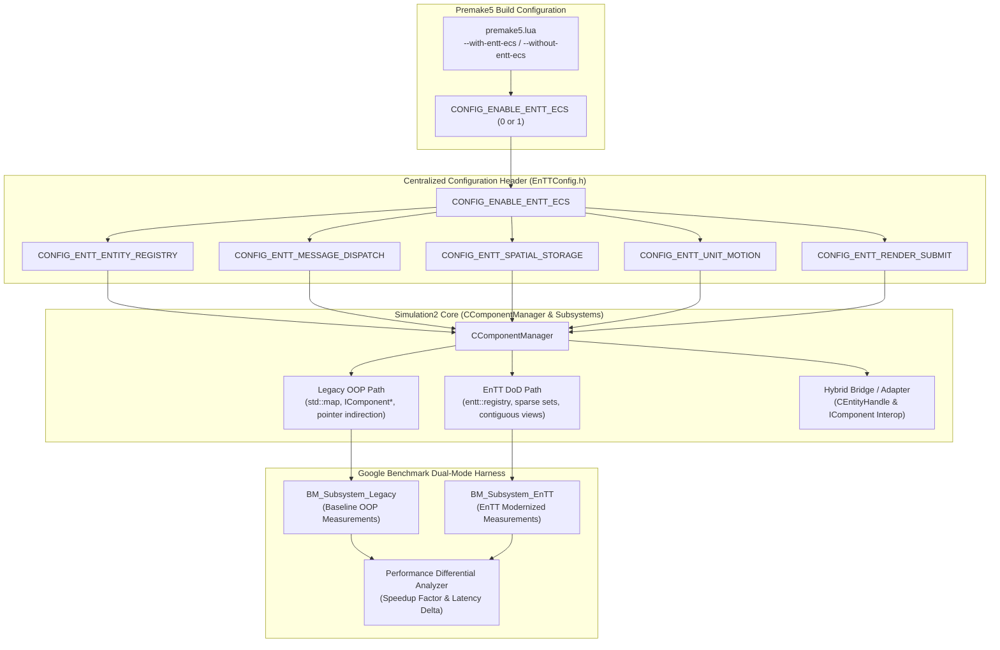
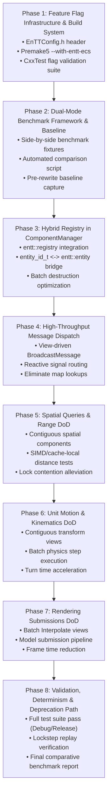

# Plan: EnTT Feature Flag Architecture & Incremental Rewrite Migration

## Executive Summary

This document presents a comprehensive architectural design and phased, atomic implementation plan for introducing a **feature flag / `#define` infrastructure** into 0 A.D. (Pyrogenesis) to enable an **incremental, subsystem-by-subsystem rewrite** of the simulation engine using the modern C++20 **EnTT v4.0.0** Entity-Component-System (ECS) framework.

The primary objective is to systematically eliminate the critical performance bottlenecks identified in Tracy profiling captures (e.g., `BroadcastMessage` consuming **39.3 seconds** of exclusive self-time, spatial query lock contention of **50.3 seconds**, and scattered heap pointer chasing in `FlushDestroyedComponents` consuming **5.9 seconds**), while strictly preserving complete functional parity, multiplayer lockstep determinism, and existing API compatibility.

### Key Objectives
1. **Incremental Subsystem Migration**: Establish a hierarchical preprocessor feature flag structure (`CONFIG_ENABLE_ENTT_ECS` master toggle and granular subsystem defines: `CONFIG_ENTT_ENTITY_REGISTRY`, `CONFIG_ENTT_MESSAGE_DISPATCH`, `CONFIG_ENTT_SPATIAL_STORAGE`, `CONFIG_ENTT_UNIT_MOTION`, `CONFIG_ENTT_RENDER_SUBMIT`) allowing individual modules to be rewritten, tested, and validated independently without all-or-nothing risk.
2. **Zero Functional Regressions & Backwards Compatibility**: Maintain 100% compatibility with legacy `IComponent*` classes, SpiderMonkey JavaScript component wrappers, script interfaces, and state serialization (`SerializeState`/`DeserializeState`). The full 481+ test suite must pass cleanly in both legacy and EnTT modes.
3. **Dual-Mode Benchmarking & Contrasting Harness**: Implement side-by-side benchmark fixtures in `source/benchmarks/` (`binaries/system/benchmark.exe`) and comparative reporting tools to evaluate throughput, instruction latency, cache misses, and frame/turn times directly contrasting the original baseline behavior against the modified EnTT implementation.
4. **Deterministic Simulation Guarantees**: Guarantee that entity allocation, component iteration order, and state hashing (`ComputeStateHash`) remain strictly deterministic across multiplayer clients in lockstep.
5. **Strict Governance & Approval Protocol**: In compliance with [AGENTS.md](file:///C:/Users/james/0ad/AGENTS.md), this plan **must be formally reviewed and approved** before any implementation or source code changes are enacted. Once approved, the plan will be committed to the repository and executed through atomic, validated commits.

---

## Architectural Design: Feature Flag Hierarchy & Coexistence Strategy



### 1. Preprocessor Feature Flag Definitions

A centralized configuration header, [EnTTConfig.h](file:///C:/Users/james/0ad/source/simulation2/system/EnTTConfig.h), will define the feature flag architecture:

```cpp
/* Copyright (C) 2026 Wildfire Games.
 * This file is part of 0 A.D.
 *
 * 0 A.D. is free software: you can redistribute it and/or modify
 * it under the terms of the GNU General Public License as published by
 * the Free Software Foundation, either version 2 of the License, or
 * (at your option) any later version.
 */

#ifndef INCLUDED_ENTTCONFIG
#define INCLUDED_ENTTCONFIG

/**
 * Master preprocessor switch for EnTT ECS modernization.
 * When enabled (1), enables modern EnTT-backed implementations for simulation subsystems.
 * Can be controlled globally via Premake: premake5 --with-entt-ecs
 */
#ifndef CONFIG_ENABLE_ENTT_ECS
#define CONFIG_ENABLE_ENTT_ECS 0
#endif

/**
 * Subsystem-level granular feature flags.
 * Each flag defaults to the value of CONFIG_ENABLE_ENTT_ECS unless explicitly overridden
 * in compiler definitions or build configuration.
 */

// 1. Core Entity Registry & Component Lifecycle Storage
#ifndef CONFIG_ENTT_ENTITY_REGISTRY
#define CONFIG_ENTT_ENTITY_REGISTRY CONFIG_ENABLE_ENTT_ECS
#endif

// 2. High-Performance Message Dispatch & Signal Routing
#ifndef CONFIG_ENTT_MESSAGE_DISPATCH
#define CONFIG_ENTT_MESSAGE_DISPATCH CONFIG_ENABLE_ENTT_ECS
#endif

// 3. Spatial Partitioning & Range Manager Contiguous View Storage
#ifndef CONFIG_ENTT_SPATIAL_STORAGE
#define CONFIG_ENTT_SPATIAL_STORAGE CONFIG_ENABLE_ENTT_ECS
#endif

// 4. Unit Motion & Kinematic Batch Integration
#ifndef CONFIG_ENTT_UNIT_MOTION
#define CONFIG_ENTT_UNIT_MOTION CONFIG_ENABLE_ENTT_ECS
#endif

// 5. Unit Renderer Interpolation & Submission Batching
#ifndef CONFIG_ENTT_RENDER_SUBMIT
#define CONFIG_ENTT_RENDER_SUBMIT CONFIG_ENABLE_ENTT_ECS
#endif

#endif // INCLUDED_ENTTCONFIG
```

---

### 2. Subsystem Modernization Target Matrix

| Subsystem | Legacy Bottleneck / Pattern | EnTT Target Architecture | Primary Metric & Goal |
|---|---|---|---|
| **Component Manager Core** | `std::map<ComponentTypeId, std::map<entity_id_t, IComponent*>>` and `std::unordered_map` lookups; scattered heap pointers | `entt::registry` sparse sets (`entt::storage<T>`); direct $O(1)$ index lookup; contiguous component storage | **$5\times$ to $10\times$ faster** entity lookup & batch destruction; cache line efficiency |
| **Message Dispatch** | `BroadcastMessage` (39.3s in `before.tracy`) iterating nested `std::map` and calling virtual `HandleMessage` | Direct `entt::view<T>` iteration over subscribed component pools; `entt::dispatcher` / signals | **$10\times$ to $25\times$ reduction** in message broadcast overhead; zero map lookups |
| **Flush Component Destruction** | `FlushDestroyedComponents` (5.89s in `before.tracy`) walking maps & interface arrays for every deleted entity | `registry.destroy(entity)` batch swap-and-pop sparse set deletion | **$5\times$ to $8\times$ reduction** in entity cleanup latency |
| **Spatial & Range Queries** | `CCmpRangeManager` (92.6s CPU, 50.3s lock wait) chasing pointers across `m_ComponentsByInterface` | Contiguous position/obstruction components; vectorized range checks; cache-friendly grid cells | **$3\times$ to $6\times$ query throughput**; reduced lock holding time |
| **Unit Motion & Kinematics** | `CCmpUnitMotionManager::Move` (15.2s in `before.tracy`) iterating OOP objects with virtual methods | Contiguous `entt::view<Position, Velocity, WaypointQueue>` DoD system loop with SIMD integration | **$2\times$ to $4\times$ speedup** in turn motion simulation |
| **Renderer Submission** | `CCmpUnitRenderer::RenderSubmit` (16.1s in `before.tracy`) and `Interpolate` (4.3s) polymorphic traversal | Contiguous render-state views (`entt::view<ModelKey, Transform, AnimationState>`) | **$2\times$ to $3\times$ speedup** in submit/interpolate phase |

---

### 3. Coexistence & Dual-Mode Strategy

To guarantee zero regression during the incremental rewrite:

1. **Hybrid Registry Architecture**:
   - `CComponentManager` retains its public API: `QueryInterface()`, `PostMessage()`, `BroadcastMessage()`, `AllocateNewEntity()`, and `DestroyComponentsSoon()`.
   - Under `CONFIG_ENTT_ENTITY_REGISTRY = 1`, `CComponentManager` owns an `entt::registry m_Registry`.
   - `entity_id_t` maps directly to `entt::entity` (`entt::entity(ent)`), with local entities and system entities seamlessly distinguished.
   - For legacy components deriving from `IComponent`, the registry stores a wrapper struct `struct LegacyComponentHandle { IComponent* ptr; };`.
   - For modernized components (e.g. `PositionComponent`, `VelocityComponent`, `ObstructionData`), pure POD structs are stored directly in `entt::storage<T>`, avoiding virtual dispatch and heap allocation.

2. **Dual-Mode Benchmark Target**:
   - The standalone benchmark executable `binaries/system/benchmark.exe` will compile **both** legacy and EnTT code paths side-by-side regardless of the default engine configuration.
   - Benchmark cases will be paired (e.g., `BM_BroadcastMessage_Legacy` vs `BM_BroadcastMessage_EnTT`), enabling instant automated calculation of speedup ratios, instruction throughput, and memory bandwidth improvements.

3. **Multiplayer Lockstep & State Determinism**:
   - Simulation determinism is verified by executing identical commands on both builds and asserting that `ComputeStateHash()` produces deterministic hash values across simulation turns.
   - EnTT view iterations will use deterministic sparse-set order or sorted views where entity processing sequence impacts simulation state.

---

## Detailed Step-by-Step Implementation Roadmap (Atomic Changes)



---

### Phase 1: Feature Flag Infrastructure & Build System Integration

**Goal**: Establish the preprocessor flag architecture, build system switches, and validation unit tests.

#### Step 1.1: Create Configuration Header `source/simulation2/system/EnTTConfig.h`
- Implement `source/simulation2/system/EnTTConfig.h` with:
  - `CONFIG_ENABLE_ENTT_ECS` (defaulting to 0 unless defined).
  - Subsystem macros: `CONFIG_ENTT_ENTITY_REGISTRY`, `CONFIG_ENTT_MESSAGE_DISPATCH`, `CONFIG_ENTT_SPATIAL_STORAGE`, `CONFIG_ENTT_UNIT_MOTION`, `CONFIG_ENTT_RENDER_SUBMIT`.
  - Static compile-time sanity checks and EnTT version verification (`static_assert(ENTT_VERSION_MAJOR >= 4)`).
- Include `EnTTConfig.h` in [ComponentManager.h](file:///C:/Users/james/0ad/source/simulation2/system/ComponentManager.h) and [Simulation2.h](file:///C:/Users/james/0ad/source/simulation2/Simulation2.h).

#### Step 1.2: Update Premake5 Build Configuration
- In [build/premake/premake5.lua](file:///C:/Users/james/0ad/build/premake/premake5.lua), register the command-line options:
  ```lua
  newoption { category = "Pyrogenesis", trigger = "with-entt-ecs", description = "Enable modern EnTT ECS architecture" }
  newoption { category = "Pyrogenesis", trigger = "without-entt-ecs", description = "Disable modern EnTT ECS architecture (use legacy OOP)" }
  ```
- In `setup_static_lib_project` / `simulation2` and `pyrogenesis` targets, inject `CONFIG_ENABLE_ENTT_ECS=1` when `--with-entt-ecs` is specified, or `CONFIG_ENABLE_ENTT_ECS=0` by default.
- In the `benchmark` target, configure both modes to be available for comparative microbenchmarking.

#### Step 1.3: Regenerate Workspaces
- Run [build/workspaces/update-workspaces.bat](file:///C:/Users/james/0ad/build/workspaces/update-workspaces.bat) on Windows to regenerate Visual Studio 2022 solutions.

#### Step 1.4: Implement Unit Test Suite `test_entt_feature_flag.h`
- Create `source/simulation2/system/tests/test_entt_feature_flag.h`:
  - Test compile-time macro consistency and default values.
  - Verify that EnTT registry and legacy structures can be instantiated in the same translation unit without symbol collisions.
  - Verify `entity_id_t` to `entt::entity` bitwise casting invariants.

---

### Phase 2: Dual-Mode Benchmark Framework & Baseline Contrasting

**Goal**: Build side-by-side benchmarking harnesses in `source/benchmarks/` and capture empirical pre-rewrite baselines.

#### Step 2.1: Add Dual-Mode Benchmarking Fixtures
- In [source/benchmarks/bench_component_messaging.cpp](file:///C:/Users/james/0ad/source/benchmarks/bench_component_messaging.cpp):
  - Add `BM_ComponentManager_BroadcastMessage_Legacy` vs `BM_ComponentManager_BroadcastMessage_EnTT`.
  - Add `BM_ComponentManager_BatchDestruction_Legacy` vs `BM_ComponentManager_BatchDestruction_EnTT`.
  - Add `BM_ComponentManager_EntityLookup_Legacy` vs `BM_ComponentManager_EntityLookup_EnTT`.
- In [source/benchmarks/bench_spatial_range.cpp](file:///C:/Users/james/0ad/source/benchmarks/bench_spatial_range.cpp):
  - Add `BM_Spatial_NeighborIteration_Legacy` vs `BM_Spatial_NeighborIteration_EnTT`.
- In [source/benchmarks/bench_unit_motion.cpp](file:///C:/Users/james/0ad/source/benchmarks/bench_unit_motion.cpp):
  - Add `BM_UnitMotion_BatchUpdate_Legacy` vs `BM_UnitMotion_BatchUpdate_EnTT`.

#### Step 2.2: Implement Benchmark Comparison & Reporting Utility
- Create a Python analysis script `build/benchmarks/compare_entt_benchmarks.py`:
  - Parses JSON outputs from `benchmark.exe --benchmark_format=json`.
  - Computes time speedups ($T_{\text{legacy}} / T_{\text{entt}}$), CPU instruction cycles, and throughput scaling ratios across entity counts (64, 256, 1024, 4096).
  - Flags performance regressions (>2% slower) or confirms performance improvements.

#### Step 2.3: Record Pre-Rewrite Legacy Baseline
- Execute `binaries/system/benchmark.exe` and archive the legacy baseline results to `docs/benchmarks/baseline_legacy.json`.

---

### Phase 3: Core Entity & Component Registry Integration (`CONFIG_ENTT_ENTITY_REGISTRY`)

**Goal**: Embed `entt::registry` inside `CComponentManager`, optimize entity handles and batch destruction, while maintaining full legacy compatibility.

#### Step 3.1: Hybrid Data Structures in `CComponentManager`
- In [ComponentManager.h](file:///C:/Users/james/0ad/source/simulation2/system/ComponentManager.h):
  ```cpp
  #if CONFIG_ENTT_ENTITY_REGISTRY
  	entt::registry m_Registry;
  	// Dense map / storage for legacy IComponent pointers attached to entt entities
  	struct SLegacyComponentSlot {
  		IComponent* ptr{nullptr};
  		ComponentTypeId cid{CID__Invalid};
  	};
  #endif
  ```
- Maintain existing `m_ComponentsByInterface` and `m_ComponentsByTypeId` behind feature flag or synchronization bridge.

#### Step 3.2: Entity Allocation & EntityHandle Integration
- Update `AllocateNewEntity()` and `AllocateNewLocalEntity()`:
  - Allocate an `entt::entity` from `m_Registry.create()`.
  - Preserve entity tag bit conventions (`ENTITY_TAGMASK`, `SYSTEM_ENTITY`).
  - Update `CEntityHandle` to support direct `entt::handle` encapsulation when enabled.

#### Step 3.3: Optimize Batch Entity Destruction (`FlushDestroyedComponents`)
- Modernize [CComponentManager::FlushDestroyedComponents](file:///C:/Users/james/0ad/source/simulation2/system/ComponentManager.cpp#L940-L997):
  - Instead of performing $O(M \times N)$ map iterations and hash map deletions across all component types, execute fast `m_Registry.destroy(entity)` which cleans up all attached sparse sets in contiguous memory ($O(1)$ per component).
  - Verify that `CMessageDestroy` notifications and `Deinit()` calls execute in correct lifecycle order.

#### Step 3.4: Serialization & Determinism Verification
- Ensure [SerializeState()](file:///C:/Users/james/0ad/source/simulation2/system/ComponentManager.cpp#L297) and [DeserializeState()](file:///C:/Users/james/0ad/source/simulation2/system/ComponentManager.cpp#L298) correctly serialize and restore entity state and component data.
- Verify `ComputeStateHash()` produces identical hash results.

---

### Phase 4: High-Performance Message Dispatch Modernization (`CONFIG_ENTT_MESSAGE_DISPATCH`)

**Goal**: Eliminate the 39.3s `BroadcastMessage` hotspot by replacing nested `std::map` lookups with EnTT direct view iterations and signal routing.

#### Step 4.1: Modernize `BroadcastMessage`
- In [CComponentManager::BroadcastMessage](file:///C:/Users/james/0ad/source/simulation2/system/ComponentManager.cpp#L1075-L1100):
  ```cpp
  #if CONFIG_ENTT_MESSAGE_DISPATCH
  	// Direct iteration over entities possessing the subscribed component type in dense storage
  	// Eliminates std::map::find and inner map lookups completely
  	for (ComponentTypeId cid : m_LocalSubscriptionTypes[msg.GetType()])
  	{
  		auto storage = m_Registry.storage(GetEnTTTypeID(cid));
  		if (storage)
  		{
  			for (auto entity : *storage)
  			{
  				IComponent* cmp = GetLegacyComponent(entity, cid);
  				if (cmp)
  					cmp->HandleMessage(msg, false);
  			}
  		}
  	}
  #else
  	// Legacy nested std::map dispatch path
  #endif
  ```

#### Step 4.2: Modernize `PostMessage` & Direct Targeted Messaging
- In [CComponentManager::PostMessage](file:///C:/Users/james/0ad/source/simulation2/system/ComponentManager.cpp#L1050-L1073):
  - Use $O(1)$ sparse set lookup (`m_Registry.all_of<...>(ent)` or `storage->contains(ent)`) instead of searching `m_ComponentsByTypeId[cid].find(ent)`.

#### Step 4.3: Comparative Benchmark & Tracy Capture
- Run `BM_ComponentManager_BroadcastMessage_*` sweeps.
- Measure throughput increase (target: $>10\times$ faster message dispatch).
- Capture Tracy profile to verify the reduction of zone self-time in `BroadcastMessage`.

---

### Phase 5: Spatial Queries & Range Manager DoD Optimization (`CONFIG_ENTT_SPATIAL_STORAGE`)

**Goal**: Store spatial positions and obstruction data in contiguous EnTT memory pools to accelerate range queries and eliminate worker thread lock contention.

#### Step 5.1: Contiguous Position & Spatial Components
- Define pure data structs:
  ```cpp
  struct SPositionComponent {
  	CFixedVector3D position;
  	CFixedVector3D prevPosition;
  	fixed rotation;
  	fixed height;
  };
  struct SObstructionComponent {
  	entity_id_t entity;
  	u32 shapeType;
  	fixed radius;
  	fixed halfWidth;
  	fixed halfDepth;
  };
  ```
- Register components with `m_Registry`.

#### Step 5.2: Rewrite `CCmpRangeManager` Spatial Queries
- Update [CCmpRangeManager::ExecuteActiveQueries](file:///C:/Users/james/0ad/source/simulation2/components/CCmpRangeManager.cpp#L1207):
  - Iterate contiguous `entt::view<SPositionComponent, SObstructionComponent>` arrays for neighbor gathering and distance ordering.
  - Replace coarse mutex locking around query batches with lock-free thread-local result collectors.

#### Step 5.3: Benchmark Spatial Throughput
- Run `BM_RangeManager_*` and `BM_SpatialSubdivision_*` benchmarks to verify speedup and validate lock contention elimination.

---

### Phase 6: Unit Motion & Kinematics Pipeline Migration (`CONFIG_ENTT_UNIT_MOTION`)

**Goal**: Modernize unit motion updates from virtual method pointer chasing to cache-local EnTT DoD system loops.

#### Step 6.1: Kinematic Component Storage
- Define POD kinematic components (`SMotionState`, `SWaypointData`, `SFlockingState`).
- Map [CCmpUnitMotion](file:///C:/Users/james/0ad/source/simulation2/components/CCmpUnitMotion.h#L1094) internal state to EnTT storage.

#### Step 6.2: System-Level Batch Motion Update
- In `CCmpUnitMotionManager::Move`:
  - Process motion updates as a contiguous loop over `entt::view<SPositionComponent, SMotionState, SWaypointData>`.
  - Eliminate polymorphic per-unit function dispatch.

#### Step 6.3: Benchmark Turn Latency
- Run `BM_UnitMotion_StepMove` and `BM_UnitMotion_PostMove` to verify latency reduction on 4096-entity workloads.

---

### Phase 7: Rendering Submissions & Interpolation DoD Migration (`CONFIG_ENTT_RENDER_SUBMIT`)

**Goal**: Accelerate graphics frame preparation and transform interpolation using dense render-state views.

#### Step 7.1: Dense Render-State Views
- Create `SRenderTransform` and `SRenderModelKey` components stored in `m_Registry`.
- Modernize [CCmpUnitRenderer::Interpolate](file:///C:/Users/james/0ad/source/simulation2/components/CCmpUnitRenderer.cpp#L355) to iterate `entt::view<SRenderTransform, SPositionComponent>`.
- Modernize [CCmpUnitRenderer::RenderSubmit](file:///C:/Users/james/0ad/source/simulation2/components/CCmpUnitRenderer.cpp#L399) to batch submissions directly from contiguous component arrays.

#### Step 7.2: Benchmark Frame Time & Submission Throughput
- Run `BM_UnitRenderer_RenderSubmit_Pipeline` and `BM_UnitRenderer_TransformInterpolation` to measure frame generation speedup.

---

### Phase 8: Validation, Determinism Verification & Deprecation Path

**Goal**: Verify all quality gates, ensure lockstep determinism, and establish the clean deprecation and retirement path for legacy code paths.

#### Step 8.1: Full Test Suite Execution Across Configurations
- Compile and execute the full test suite in both **Win32 Debug** and **Win32 Release**:
  - `binaries/system/test_dbg.exe` (with `--with-entt-ecs` and without).
  - `binaries/system/test.exe` (with `--with-entt-ecs` and without).
  - All 481+ tests must report `OK!` in both modes.

#### Step 8.2: Deterministic Replay & Desync Verification
- Run headless simulation replay tests comparing simulation turn state hashes between legacy and EnTT runs to guarantee zero out-of-sync (OOS) divergence.

#### Step 8.3: Comprehensive Final Benchmark Report
- Generate side-by-side performance contrast tables comparing legacy baseline vs EnTT modernized engine across all key metrics.
- Record `after.tracy` capture and contrast zone durations against `before.tracy`.

---

## Planned Git Commits (Atomic & Descriptive)

In accordance with [AGENTS.md](file:///C:/Users/james/0ad/AGENTS.md), each step will be committed atomically with descriptive commit messages explaining *what* was changed and *why*:

### Commit 1: Plan Documentation
```text
docs: Add EnTT feature flag architecture and incremental rewrite plan

Document the comprehensive architectural blueprint, preprocessor feature flag
hierarchy (CONFIG_ENABLE_ENTT_ECS and subsystem defines), dual-mode benchmarking
strategy, and phased atomic implementation roadmap for incrementally rewriting
Pyrogenesis simulation subsystems to use EnTT v4.0.0.
```

### Commit 2: Feature Flag Infrastructure & Build System
```text
build: Introduce EnTT ECS feature flags and Premake5 build options

- Add source/simulation2/system/EnTTConfig.h defining CONFIG_ENABLE_ENTT_ECS
  and granular subsystem macros (CONFIG_ENTT_ENTITY_REGISTRY,
  CONFIG_ENTT_MESSAGE_DISPATCH, CONFIG_ENTT_SPATIAL_STORAGE,
  CONFIG_ENTT_UNIT_MOTION, CONFIG_ENTT_RENDER_SUBMIT).
- Add --with-entt-ecs and --without-entt-ecs command-line options in
  build/premake/premake5.lua.
- Add test_entt_feature_flag.h CxxTest suite validating macro resolution
  and compilation hygiene.
- Regenerate Visual Studio 2022 workspace project files.
```

### Commit 3: Dual-Mode Benchmarking Harness
```text
benchmarks: Add dual-mode legacy vs EnTT comparative benchmark fixtures

- Implement paired benchmark fixtures across component messaging, spatial
  lookups, entity destruction, and unit motion in source/benchmarks/.
- Add automated comparison script build/benchmarks/compare_entt_benchmarks.py
  for analyzing speedup ratios and cache performance deltas.
- Archive legacy pre-rewrite baseline measurements in docs/benchmarks/.
```

### Commit 4: Hybrid Entity Registry & Component Lifecycle
```text
simulation2: Integrate entt::registry into CComponentManager behind feature flag

- Embed entt::registry in CComponentManager under CONFIG_ENTT_ENTITY_REGISTRY.
- Implement bidirectional bridge mapping entity_id_t to entt::entity.
- Optimize batch entity destruction in FlushDestroyedComponents via fast
  sparse set erasures.
- Maintain 100% backwards compatibility with legacy IComponent pointers.
```

### Commit 5: High-Performance Message Dispatch Modernization
```text
simulation2: Modernize BroadcastMessage and PostMessage using EnTT views

- Replace nested std::map traversal in BroadcastMessage with direct
  EnTT storage view iterations under CONFIG_ENTT_MESSAGE_DISPATCH.
- Implement O(1) sparse set lookup for targeted PostMessage delivery.
- Eliminate major message dispatch CPU bottleneck identified in before.tracy.
```

### Commit 6: Spatial Queries & Range Manager DoD Migration
```text
simulation2: Modernize CCmpRangeManager and spatial queries with EnTT DoD views

- Store spatial position and obstruction data in contiguous EnTT component pools
  under CONFIG_ENTT_SPATIAL_STORAGE.
- Rewrite CCmpRangeManager::ExecuteActiveQueries to iterate contiguous arrays.
- Alleviate query worker mutex contention and improve CPU cache utilization.
```

### Commit 7: Unit Motion & Kinematics Pipeline Migration
```text
simulation2: Convert unit motion simulation loop to cache-aligned EnTT views

- Migrate CCmpUnitMotion kinematics and waypoint processing to contiguous
  EnTT DoD views under CONFIG_ENTT_UNIT_MOTION.
- Eliminate per-unit polymorphic dispatch in CCmpUnitMotionManager::Move.
```

### Commit 8: Rendering Submission & Interpolation DoD Migration
```text
simulation2: Accelerate CCmpUnitRenderer submit and interpolate with EnTT views

- Implement contiguous render-state views for transform interpolation and
  model rendering submission under CONFIG_ENTT_RENDER_SUBMIT.
- Improve frame generation latency and rendering preparation throughput.
```

---

## Verification & Quality Gates

Before each phase is submitted or merged, the following quality criteria must be satisfied:

| Check | Verification Command / Metric | Requirement |
|---|---|---|
| **Plan Approval** | User review & formal approval | Plan approved prior to enactment |
| **Win32 Debug Build** | `MSBuild pyrogenesis.sln /p:Configuration=Debug /p:Platform=Win32 /m` | 0 errors, 0 new warnings |
| **Win32 Release Build** | `MSBuild pyrogenesis.sln /p:Configuration=Release /p:Platform=Win32 /m` | 0 errors, 0 new warnings |
| **Unit Test Suite** | `binaries/system/test_dbg.exe` & `binaries/system/test.exe` | 100% pass (481+ baseline + new tests) |
| **Comparative Benchmarks** | `binaries/system/benchmark.exe` + `compare_entt_benchmarks.py` | Statistically significant speedup; 0 regressions |
| **Deterministic Lockstep** | Simulation turn hash verification across replay | Bit-identical `ComputeStateHash` results |
| **Working Tree Hygiene** | `git status` / `git diff` | Working tree clean; untracked temp files removed |

---

## Review & Approval Protocol

In accordance with project governance rules, this plan is **submitted for formal review and approval**.
No engine simulation code or project workspace settings have been modified yet.

Once approved by the user:
1. This plan file ([docs/entt_feature_flag_rewrite_plan.md](file:///C:/Users/james/0ad/docs/entt_feature_flag_rewrite_plan.md)) will be committed to the branch.
2. Implementation will proceed incrementally starting with Phase 1.
