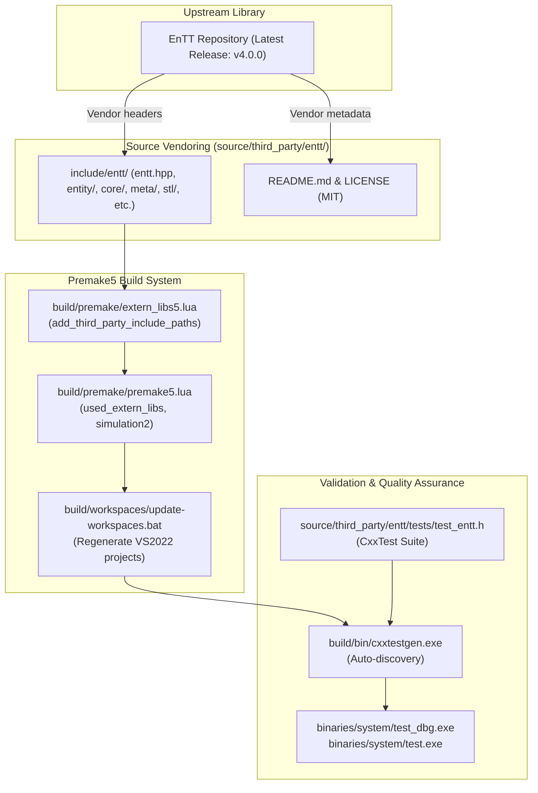

# Plan: EnTT Integration & Build Validation in 0 A.D.

## Executive Summary

The purpose of this initiative is to integrate the latest version of the **EnTT** Entity-Component-System (ECS) library (**v4.0.0**) into the 0 A.D. (Pyrogenesis) codebase.

EnTT v4.0.0 represents a major evolutionary milestone for the library, fully embracing **C++20 concepts**, optimized storage and component destruction for trivially destructible types, direct view-to-view conversion, customizable STL injection (`entt/stl/`), and configuration injection via `<entt/ext/config.h>`.

In accordance with project guidelines, this plan is strictly scoped to:
1. Vendoring the modern, header-only EnTT v4.0.0 library into `source/third_party/entt/`.
2. Configuring the Premake5 build system (`build/premake/extern_libs5.lua` and `build/premake/premake5.lua`) and regenerating workspace project files.
3. Implementing a dedicated CxxTest unit test suite (`source/third_party/entt/tests/test_entt.h`) validating that EnTT v4.0.0 compiles cleanly, links without errors, and executes reliably across all configurations (MSVC 2022 Win32 Debug/Release, GCC, Clang) in harmony with 0 A.D.'s engine types.
4. Validating that all existing engine test suites and the new EnTT test cases pass with zero regressions and zero compiler warnings.

> [!IMPORTANT]
> This plan **must be reviewed and approved** before any implementation or code modifications are enacted. Refactoring existing simulation components or game logic to use EnTT is deliberately out of scope for this foundational integration phase and will be addressed in subsequent dedicated plans.

---

## Architecture & Integration Strategy



### Key Highlights of EnTT v4.0.0 for 0 A.D.

1. **Native C++20 Alignment**:
   - 0 A.D. already targets `C++20` across all platforms ([premake5.lua](file:///C:/Users/james/0ad/build/premake/premake5.lua#L507)).
   - EnTT v4.0.0 replaces legacy SFINAE type traits with native C++20 concepts (`entt_like`, `enum_bitmask`, `cvref_unqualified`, `meta_policy`), resulting in faster template instantiation and significantly clearer compiler error messages.
2. **Performance Improvements**:
   - Optimized storage and component destruction for trivially destructible types.
   - Storage shrinking and empty type optimizations.
3. **Clean External Include Isolation**:
   - EnTT headers are included via `externalincludedirs` using `add_third_party_include_paths("entt")`. This guarantees that MSVC (`/external:I`) and GCC/Clang (`-isystem`) treat EnTT as an external library and suppress third-party compiler warnings, preserving 0 A.D.'s strict warning levels (`/W4` / `-Wall`).
4. **Zero-Regression Guarantee**:
   - Win32 Debug and Win32 Release configurations must compile cleanly and pass all 477 baseline tests plus the new EnTT validation test suite before changes are submitted.

---

## Detailed Step-by-Step Roadmap (Atomic Changes)

### Phase 1: Source Preparation & Vendoring

**Goal**: Vendor the EnTT v4.0.0 headers and licensing documentation under `source/third_party/entt/` without modifying build configuration yet.

#### Step 1.1: Vendor EnTT v4.0.0 Headers
- Fetch the upstream tag `v4.0.0` from `https://github.com/skypjack/entt`.
- Place the complete EnTT v4.0.0 include tree into `source/third_party/entt/include/entt/`:
  - Master single-include / umbrella header: `entt/entt.hpp`
  - Core modules:
    - `entt/config/` (version v4.0.0, macro configurations, `ENTT_NO_EXCEPTION`)
    - `entt/core/` (concepts, type traits, hashing, `any`, `family`, `utility`)
    - `entt/entity/` (registry, view, group, observer, storage, component, entity, `entt_like` concept)
    - `entt/locator/` (service locator)
    - `entt/meta/` (reflection, `meta_base`, `meta_any`, `meta_policy`, `std::string_view` naming)
    - `entt/poly/` (static polymorphism helpers)
    - `entt/process/` (cooperative scheduler)
    - `entt/resource/` (cache, loader, handle)
    - `entt/signal/` (delegate, dispatcher, emitter, sigh)
    - `entt/stl/` (custom STL injection and standard library abstractions)

#### Step 1.2: Add Third-Party Documentation & License
- Create `source/third_party/entt/README.md`:
  - Upstream URL: `https://github.com/skypjack/entt`
  - Tag/Version: `v4.0.0` (commit `85c6bba014049b5de8fad49d25424df2f1f6a8c1`)
  - Purpose: Modern C++20 Entity Component System library for high-performance simulation components
  - Vendoring Date & instructions for future upgrades
- Create `source/third_party/entt/LICENSE`:
  - Standard MIT License text (Copyright (c) 2017-2025 Michele Caini).

---

### Phase 2: Build System Configuration (Premake5)

**Goal**: Expose EnTT v4.0.0 to the build system, configure projects, and regenerate workspace files.

#### Step 2.1: Update `build/premake/extern_libs5.lua`
- Add the `entt` library definition to `extern_lib_defs` in [extern_libs5.lua](file:///C:/Users/james/0ad/build/premake/extern_libs5.lua):
  ```lua
  entt = {
      compile_settings = function()
          add_third_party_include_paths("entt")
      end,
  },
  ```

#### Step 2.2: Update `build/premake/premake5.lua`
- In [premake5.lua](file:///C:/Users/james/0ad/build/premake/premake5.lua#L1126-L1152), add `"entt"` to `used_extern_libs` so that both `pyrogenesis` (main game executable) and `test` (test suite executable) have the include path configured.
- In [premake5.lua](file:///C:/Users/james/0ad/build/premake/premake5.lua#L864-L873), add `"entt"` to the `extern_libs` table of the `simulation2` static library.

#### Step 2.3: Regenerate Visual Studio 2022 Workspaces
- Execute [update-workspaces.bat](file:///C:/Users/james/0ad/build/workspaces/update-workspaces.bat) on Windows to regenerate:
  - `build/workspaces/vs2022/pyrogenesis.vcxproj`
  - `build/workspaces/vs2022/simulation2.vcxproj`
  - `build/workspaces/vs2022/test.vcxproj`

---

### Phase 3: Validation Unit Test Suite

**Goal**: Implement comprehensive CxxTest unit tests validating EnTT v4.0.0 features, compilation, linking, and data type interoperability.

#### Step 3.1: Create `source/third_party/entt/tests/test_entt.h`
Create the test suite inheriting from `CxxTest::TestSuite` with the following test cases tailored to EnTT v4.0.0:

```cpp
/* Copyright (C) 2026 Wildfire Games.
 * This file is part of 0 A.D.
 *
 * 0 A.D. is free software: you can redistribute it and/or modify
 * it under the terms of the GNU General Public License as published by
 * the Free Software Foundation, either version 2 of the License, or
 * (at your option) any later version.
 */

#include "lib/self_test.h"

#include <entt/entt.hpp>
#include "maths/FixedVector3D.h"
#include "ps/CStr.h"

class TestEnTT : public CxxTest::TestSuite
{
public:
    // Component definitions for testing
    struct Position
    {
        float x{0.0f};
        float y{0.0f};
        float z{0.0f};
    };

    struct Velocity
    {
        float dx{0.0f};
        float dy{0.0f};
        float dz{0.0f};
    };

    struct UnitData
    {
        CStr name;
        CFixedVector3D spawnPoint;
        uint32_t health{100};
    };

    // Test 1: Basic Entity & Component Lifecycle (CRUD)
    void test_registry_entity_lifecycle()
    {
        entt::registry registry;

        entt::entity e1 = registry.create();
        TS_ASSERT(registry.valid(e1));

        // Emplace component
        registry.emplace<Position>(e1, 10.0f, 20.0f, 30.0f);
        TS_ASSERT(registry.all_of<Position>(e1));

        // Read component
        const Position& pos = registry.get<Position>(e1);
        TS_ASSERT_EQUALS(pos.x, 10.0f);
        TS_ASSERT_EQUALS(pos.y, 20.0f);
        TS_ASSERT_EQUALS(pos.z, 30.0f);

        // Replace component
        registry.replace<Position>(e1, 50.0f, 60.0f, 70.0f);
        TS_ASSERT_EQUALS(registry.get<Position>(e1).x, 50.0f);

        // Remove component
        registry.remove<Position>(e1);
        TS_ASSERT(!registry.all_of<Position>(e1));

        // Destroy entity
        registry.destroy(e1);
        TS_ASSERT(!registry.valid(e1));
    }

    // Test 2: Views and Multi-Component Iteration (EnTT v4 view-to-view & fast iteration)
    void test_registry_view_iteration()
    {
        entt::registry registry;

        for (int i = 0; i < 10; ++i)
        {
            auto entity = registry.create();
            registry.emplace<Position>(entity, static_cast<float>(i), 0.0f, 0.0f);
            if (i % 2 == 0)
                registry.emplace<Velocity>(entity, 1.0f, 2.0f, 3.0f);
        }

        // Iterate over entities with both Position and Velocity
        auto view = registry.view<Position, const Velocity>();
        size_t count = 0;
        view.each([&count](Position& pos, const Velocity& vel) {
            pos.x += vel.dx;
            pos.y += vel.dy;
            pos.z += vel.dz;
            ++count;
        });

        TS_ASSERT_EQUALS(count, 5u);
    }

    // Test 3: Reactive Observers & Signals
    void test_signals_and_listeners()
    {
        entt::registry registry;
        size_t constructCount = 0;

        auto listener = [&constructCount](entt::registry&, entt::entity) {
            ++constructCount;
        };

        registry.on_construct<Position>().connect<&decltype(listener)::operator()>(&listener);

        auto e1 = registry.create();
        registry.emplace<Position>(e1, 1.0f, 2.0f, 3.0f);

        auto e2 = registry.create();
        registry.emplace<Position>(e2, 4.0f, 5.0f, 6.0f);

        TS_ASSERT_EQUALS(constructCount, 2u);
    }

    // Test 4: Engine Type & Struct Compatibility (CStr, CFixedVector3D)
    void test_engine_types_compatibility()
    {
        entt::registry registry;
        auto e = registry.create();

        registry.emplace<UnitData>(e, CStr("Hoplite"), CFixedVector3D(fixed::FromInt(5), fixed::FromInt(0), fixed::FromInt(10)), 150u);

        TS_ASSERT(registry.all_of<UnitData>(e));
        const auto& data = registry.get<UnitData>(e);
        TS_ASSERT_EQUALS(data.name, "Hoplite");
        TS_ASSERT_EQUALS(data.health, 150u);
        TS_ASSERT_EQUALS(data.spawnPoint.X.ToInt(), 5);
        TS_ASSERT_EQUALS(data.spawnPoint.Z.ToInt(), 10);
    }
};
```

#### Step 3.2: Re-run Workspace Generator for Test Discovery
- Premake5's test setup (`setup_tests` in [premake5.lua](file:///C:/Users/james/0ad/build/premake/premake5.lua#L1566)) uses `os.matchfiles(source_root .. "**/tests/*.h")`.
- Running `update-workspaces.bat` will automatically discover `source/third_party/entt/tests/test_entt.h` and generate `test_entt.cpp` inside `build/workspaces/vs2022/generated/`.

---

### Phase 4: Compilation, Linking & Test Execution

**Goal**: Validate full compilation, clean linkage, and successful test execution across configurations.

#### Step 4.1: Win32 Debug Build & Test
- Build `pyrogenesis` and `test` projects in **Debug (Win32)**:
  ```powershell
  MSBuild.exe build\workspaces\vs2022\pyrogenesis.sln /p:Configuration=Debug /p:Platform=Win32 /m
  ```
- Run `binaries\system\test_dbg.exe` and confirm:
  - Total test count increases from 477 to 481.
  - All 481 tests report `OK!`.

#### Step 4.2: Win32 Release Build & Test
- Build `pyrogenesis` and `test` projects in **Release (Win32)**:
  ```powershell
  MSBuild.exe build\workspaces\vs2022\pyrogenesis.sln /p:Configuration=Release /p:Platform=Win32 /m
  ```
- Run `binaries\system\test.exe` and confirm:
  - All 481 tests pass cleanly under release optimizations.

#### Step 4.3: Compiler Warning & Header Hygiene Verification
- Confirm zero warnings generated from EnTT headers under MSVC (`/W4` / `/external:W0`) and GCC/Clang.

---

## Planned Git Commits (Atomic & Descriptive)

Following [AGENTS.md](file:///C:/Users/james/0ad/AGENTS.md) rules, the changes will be committed atomically:

### Commit 1
```text
third_party: Vendor EnTT v4.0.0 header-only library

Add the complete upstream header tree for EnTT v4.0.0 (latest major
release) under source/third_party/entt/include/ along with README.md
documentation and LICENSE (MIT).

EnTT v4.0.0 provides a modern, concept-driven C++20 entity-component-system
framework with optimized storage, view conversions, and reflection capabilities.
```

### Commit 2
```text
build: Configure Premake5 for EnTT and regenerate VS2022 workspaces

- Add 'entt' library definition in build/premake/extern_libs5.lua using
  add_third_party_include_paths to enable warning-free external includes.
- Add 'entt' to used_extern_libs and simulation2 static library in
  build/premake/premake5.lua.
- Regenerate Visual Studio 2022 project files.
```

### Commit 3
```text
tests: Add EnTT validation test suite covering registry, views, and engine types

Implement TestEnTT in source/third_party/entt/tests/test_entt.h with
CxxTest test cases covering:
- Entity creation, destruction, and component CRUD operations
- Multi-component view iteration
- Reactive construct/destroy signal listeners
- Interoperability with 0 A.D. engine types (CStr, CFixedVector3D)

Regenerate workspace files to register the test with cxxtestgen.
```

---

## Verification & Quality Gates

Before submission, each of the following criteria must be satisfied:

| Check | Requirement | Status |
| :--- | :--- | :--- |
| **Plan Review** | Plan reviewed and approved by user | ⏳ Awaiting Review |
| **Clean Headers** | EnTT v4.0.0 headers vendored with MIT license & README | Pending Approval |
| **Build System** | Premake5 builds without errors or missing includes | Pending Approval |
| **Win32 Debug** | `pyrogenesis_dbg.exe` and `test_dbg.exe` build cleanly | Pending Approval |
| **Win32 Release** | `pyrogenesis.exe` and `test.exe` build cleanly | Pending Approval |
| **Test Suite** | `test_dbg.exe` and `test.exe` pass all 481 tests (477 baseline + 4 EnTT) | Pending Approval |
| **Working Tree** | Untracked temporary files cleaned up (`git clean`/`checkout`) | Pending Approval |

---

## Review & Approval Request

This plan is complete and updated for the latest EnTT version (**v4.0.0**). **No code or project files have been altered.**
Please review the updated plan. Once approved, implementation can proceed according to the phases above.
