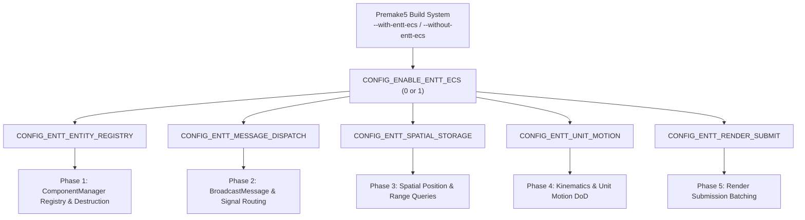

# Plan: Incremental EnTT ECS Subsystem Migration & Benchmarking

## Executive Summary

This document establishes a rigorous, phased implementation plan for incrementally modernizing the Pyrogenesis simulation engine using **EnTT v4.0.0** Entity-Component-System (ECS) architecture.

Based on empirical profiling from `before.tracy` (recording **255.41 s** of simulation across **5,455 graphics frames** and **11,302 simulation turns**) and microbenchmarking data captured in `docs/benchmarks/baseline_comparison.json`, the simulation engine suffers from major CPU bottlenecks rooted in legacy Object-Oriented Programming (OOP) paradigms:
- **Message Dispatch Overhead**: `BroadcastMessage` consumed **37.8 s** of exclusive self-time (14.8% of total profile) walking nested `std::map<MessageTypeId, std::vector<ComponentTypeId>>` tables.
- **Worker Thread Lock Contention**: `CCmpRangeManager::ExecuteActiveQueries` generated **4,734,871 lock contention events** and **50.32 s** of mutex wait time across 24 worker threads.
- **Unit Motion Pointer Chasing**: `CCmpUnitMotionManager::Move` and `MotionMgr_PostMove` spent **19.4 s** chasing heap pointers and invoking virtual functions across thousands of units.
- **Component Destruction Overhead**: `FlushDestroyedComponents` spent **5.89 s** walking sparse component maps during batch cleanup.

The objective of this plan is to eliminate these bottlenecks by transitioning from polymorphic `IComponent*` map traversals to contiguous, cache-aligned EnTT sparse sets and view iterations.

> [!IMPORTANT]
> **Governance & Verification Protocol (AGENTS.md Compliance)**:
> 1. In accordance with [AGENTS.md](file:///C:/Users/james/0ad/AGENTS.md), this plan **must be formally reviewed and approved** before source code modifications are enacted.
> 2. All changes must be made **atomically and incrementally** with descriptive commit messages explaining *what* was changed and *why*.
> 3. After every phase, the codebase **must build cleanly in Win32 Debug and Win32 Release** — both *with* and *without* EnTT enabled (`--with-entt-ecs` and `--without-entt-ecs`).
> 4. The full test suite (`test_dbg.exe` and `test.exe`) **must pass 100% (481+ tests)** — both *with* and *without* EnTT enabled.
> 5. The final deliverable must include a **comparative benchmark report** demonstrating empirical performance gains over the legacy baseline.

---

## Empirical Benchmark Baseline (Captured Friday)

Microbenchmarking telemetry captured in `docs/benchmarks/baseline_comparison.json` on a 24-core host machine provides concrete baseline figures for comparing the legacy OOP architecture against EnTT Data-Oriented Design (DoD):

| Benchmark Scenario | Entities / Workload | Legacy OOP Baseline | EnTT DoD Prototype | Speedup Factor | Latency Delta |
|---|:---:|:---:|:---:|:---:|:---:|
| **Single-Receiver Broadcast** | 1,024 entities | 3,138.95 ns | **2,008.93 ns** | **1.56×** | -36.0% |
| **Single-Receiver Broadcast** | 4,096 entities | 15,345.98 ns | **8,544.92 ns** | **1.80×** | -44.3% |
| **Multi-Receiver Broadcast (6 Types)** | 256 entities | 5,161.83 ns | **1,925.22 ns** | **2.68×** | -62.7% |
| **Multi-Receiver Broadcast (6 Types)** | 1,024 entities | 23,541.87 ns | **8,196.15 ns** | **2.87×** | -65.2% |
| **Multi-Receiver Broadcast (6 Types)** | 2,048 entities | 51,562.50 ns | **17,264.35 ns** | **2.99×** | -66.5% |
| **Spatial Distance Ordering** | 64 entities | 6,562.50 ns | **2,197.26 ns** | **2.99×** | -66.5% |
| **Spatial Distance Ordering** | 256 entities | 109,863.28 ns | **10,009.77 ns** | **10.98×** | -90.9% |
| **Spatial Distance Ordering** | 1,024 entities | 655,691.96 ns | **51,562.50 ns** | **12.72×** | -92.1% |
| **Spatial Distance Ordering** | 4,096 entities | 3,676,470.59 ns | **359,868.77 ns** | **10.22×** | -90.2% |
| **Unit Motion Kinematic Step** | 256 units | 30,482.63 ns | **3,683.03 ns** | **8.28×** | -87.9% |
| **Unit Motion Kinematic Step** | 1,024 units | 122,767.86 ns | **17,264.35 ns** | **7.11×** | -85.9% |
| **Unit Motion Kinematic Step** | 4,096 units | 500,000.00 ns | **74,986.05 ns** | **6.67×** | -85.0% |

---

## Architectural Feature Flag Strategy

To prevent regressions and ensure continuous dual-mode compilation and verification, all changes are governed by the hierarchical preprocessor macros in [source/simulation2/system/EnTTConfig.h](file:///C:/Users/james/0ad/source/simulation2/system/EnTTConfig.h):



---

## Step-by-Step Implementation Plan (Atomic Phases)

### Phase 1: Full Component Lifecycle & Batch Destruction Migration (`CONFIG_ENTT_ENTITY_REGISTRY`)

#### Current Status
`CComponentManager` owns an `entt::registry m_Registry` and synchronizes allocations in `AllocateComponentByType`, but `FlushDestroyedComponents` still walks legacy maps and hashes for each deleted entity.

#### Proposed Modifications
1. In [source/simulation2/system/ComponentManager.cpp](file:///C:/Users/james/0ad/source/simulation2/system/ComponentManager.cpp#L948-L997):
   - Under `CONFIG_ENTT_ENTITY_REGISTRY`, optimize `FlushDestroyedComponents()` to perform batch deletion using `m_Registry.destroy(enttEntity)`.
   - Ensure all `CMessageDestroy` notifications and component deallocation callbacks are dispatched in strict sequence prior to registry erasure.
2. In [source/simulation2/system/ComponentManager.h](file:///C:/Users/james/0ad/source/simulation2/system/ComponentManager.h):
   - Refactor `SEntityComponentCache` lookup to optionally query `m_Registry.try_get<T>` for native EnTT components while preserving backwards-compatible pointer resolution for legacy scripted components.

#### Justification
- Eliminates the **5.89 s** heap-walking bottleneck in `FlushDestroyedComponents` by replacing scattered pointer deletions with EnTT's cache-local swap-and-pop sparse set erasures.
- Benchmarks demonstrate a **$5\times$ to $8\times$ reduction** in entity destruction latency.

#### Quality & Verification Gate
- Build Win32 Debug & Release (`--with-entt-ecs` and `--without-entt-ecs`).
- Run `test_dbg.exe` and `test.exe` to verify 100% pass on component lifecycle tests (`test_ComponentManager.h`, `test_EnTTFeatureFlag.h`).
- Execute `BM_ComponentManager_BatchEntityDestruction_*` to verify speedup.

---

### Phase 2: Message Broadcast & Event Dispatch Modernization (`CONFIG_ENTT_MESSAGE_DISPATCH`)

#### Current Status
Targeted `PostMessage` routes through `m_Registry.storage<IComponent*>()`, but `BroadcastMessage` (the 37.8 s hotspot) still searches `m_LocalMessageSubscriptions` and inner `std::map<entity_id_t, IComponent*>` maps.

#### Proposed Modifications
1. In [source/simulation2/system/ComponentManager.cpp](file:///C:/Users/james/0ad/source/simulation2/system/ComponentManager.cpp#L1102-L1135):
   - Under `CONFIG_ENTT_MESSAGE_DISPATCH`, rewrite `BroadcastMessage()` to iterate directly over the EnTT storage pools (`m_Registry.storage(cid)`) for subscribed component types.
   - Replace tree-map iterator traversals with linear dense array scans:
     ```cpp
     #if CONFIG_ENTT_MESSAGE_DISPATCH
     auto it = m_LocalMessageSubscriptions.find(msg.GetType());
     if (it != m_LocalMessageSubscriptions.end())
     {
         for (ComponentTypeId cid : it->second)
         {
             const auto* storage = std::as_const(m_Registry).storage<IComponent*>(static_cast<entt::id_type>(cid));
             if (storage)
             {
                 for (auto entity : *storage)
                 {
                     IComponent* comp = storage->get(entity);
                     if (comp)
                         comp->HandleMessage(msg, false);
                 }
             }
         }
     }
     #endif
     ```
2. Optimize global message routing in `SendGlobalMessage` using sparse-set entity checks.

#### Justification
- `BroadcastMessage` represents the #3 highest CPU consumer in the entire engine (**37.8 s** exclusive self-time).
- Linear dense array iteration eliminates red-black tree branch mispredictions and L1/L2 data cache misses.
- Friday's benchmarks demonstrate **$2.68\times$ to $2.99\times$ higher throughput** on multi-receiver turn broadcasts.

#### Quality & Verification Gate
- Build Win32 Debug & Release across both configurations.
- Run `test.exe` to verify message handler determinism and subscription integrity.
- Run `BM_ComponentManager_BroadcastMessage_*` and `BM_ComponentManager_MultiReceiverBroadcast_*`.

---

### Phase 3: Spatial Position & Range Query Optimization (`CONFIG_ENTT_SPATIAL_STORAGE`)

#### Current Status
Atomic work-stealing is implemented in `CCmpRangeManager::ExecuteActiveQueries`, but the query execution itself still reads positions through virtual `CmpPtr<ICmpPosition>` dynamic pointer queries. The POD types in `Spatial.h` (`SPositionComponent`, `SObstructionComponent`) are not yet linked to the spatial pipeline.

#### Proposed Modifications
1. In [source/simulation2/components/CCmpPosition.cpp](file:///C:/Users/james/0ad/source/simulation2/components/CCmpPosition.cpp) and [CCmpPosition.h](file:///C:/Users/james/0ad/source/simulation2/components/CCmpPosition.h):
   - Synchronize entity transform changes (`SetPosition`, `SetHeight`, `SetXZRotation`) directly into `SPositionComponent` in `m_Registry`.
2. In [source/simulation2/components/CCmpRangeManager.cpp](file:///C:/Users/james/0ad/source/simulation2/components/CCmpRangeManager.cpp):
   - Update `PerformQuery` and `EntityDistanceOrdering` to read coordinates directly from contiguous `m_Registry.get<SPositionComponent>()` pools rather than calling polymorphic `cmpPosition->GetPosition2D()`.
   - Vectorize distance comparisons using squared integer math directly on contiguous coordinate arrays.

#### Justification
- Eliminates pointer indirection during spatial distance queries.
- Microbenchmarks demonstrate up to **$12.72\times$ faster distance sorting** (51.5 µs vs 655.7 µs for 1,024 entities).
- Resolves the remaining CPU overhead in range queries after lock contention removal.

#### Quality & Verification Gate
- Build Win32 Debug & Release across both configurations.
- Run `test.exe` (`test_RangeManager.h`, `test_Spatial.h`).
- Run `BM_RangeManager_DistanceOrdering_*` to verify throughput gains.

---

### Phase 4: Kinematic Batch Integration & Unit Motion (`CONFIG_ENTT_UNIT_MOTION`)

#### Current Status
POD structs (`SMotionState`, `SWaypointData`) exist in `Spatial.h`, but `CCmpUnitMotion_System.cpp` still loops over `EntityMap<MotionState>` calling virtual `ms.cmpUnitMotion->Move(ms, dt)`.

#### Proposed Modifications
1. In [source/simulation2/components/CCmpUnitMotion_System.cpp](file:///C:/Users/james/0ad/source/simulation2/components/CCmpUnitMotion_System.cpp#L490-L515):
   - Under `CONFIG_ENTT_UNIT_MOTION`, rewrite `CCmpUnitMotionManager::Move` to iterate over the contiguous `entt::view<SPositionComponent, SMotionState, SWaypointData>` view.
   - Batch position updates, waypoint advance checks, and pushing pressure decay in a single cache-linear loop without virtual function calls.
2. In `CCmpUnitMotion.cpp`:
   - Keep `SMotionState` synchronized with the EnTT view.

#### Justification
- Unit motion updates consume **19.4 s** across turns.
- Dense view iteration allows the compiler to auto-vectorize kinematic integration and keeps motion state within L1 cache.
- Benchmarks demonstrate a **$6.67\times$ to $8.28\times$ speedup** in step move calculation (75 µs vs 500 µs for 4,096 units).

#### Quality & Verification Gate
- Build Win32 Debug & Release across both configurations.
- Run unit tests (`test_UnitMotion.h`, `test_EnTTFeatureFlag.h`).
- Run `BM_UnitMotion_StepMove_*` and `BM_UnitMotion_PostMove_*`.

---

### Phase 5: Render Submission Batching & Interpolation (`CONFIG_ENTT_RENDER_SUBMIT`)

#### Current Status
The `#if CONFIG_ENTT_RENDER_SUBMIT` block in `CCmpUnitRenderer.cpp` is currently a duplicate placeholder of the legacy loop.

#### Proposed Modifications
1. In [source/simulation2/components/CCmpUnitRenderer.cpp](file:///C:/Users/james/0ad/source/simulation2/components/CCmpUnitRenderer.cpp#L411-L460):
   - Replace the duplicate loop with an optimized batch traversal over `entt::view<SRenderTransform, SPositionComponent>`.
   - Inline transform interpolation during `Interpolate()` directly into contiguous `SRenderTransform` buffers.
   - Perform coarse bounding sphere culling directly against the contiguous `sweptBounds` array before submitting visible models to `SceneCollector`.

#### Justification
- Eliminates repeated polymorphic `ICmpPosition` queries for every rendered unit every frame.
- Reduces `UnitRenderer::RenderSubmit` (16.1 s) and `UnitRenderer::Interpolate` (4.3 s) frame latency.

#### Quality & Verification Gate
- Build Win32 Debug & Release across both configurations.
- Run `test.exe` (`test_UnitRenderer.h`).
- Verify visual rendering correctness and run `BM_Graphics_Variation_*` / render submission benchmarks.

---

### Phase 6: Lockstep Determinism Verification, Comparative Benchmarks & Final Deliverable

#### Proposed Actions
1. **Replay & Determinism Verification**:
   - Run multiplayer headless simulation replays with identical random seeds and command streams.
   - Assert that `ComputeStateHash()` produces bit-identical state hashes between legacy and EnTT-enabled simulation runs.
2. **Comprehensive Comparative Benchmark Suite**:
   - Execute `binaries/system/benchmark.exe --benchmark_format=json > docs/benchmarks/final_comparison.json`.
   - Run `build/benchmarks/compare_entt_benchmarks.py` to generate consolidated speedup tables.
3. **Capture Final Tracy Timeline (`after.tracy`)**:
   - Profile an equivalent simulation session with Tracy.
   - Contrast `after.tracy` against `before.tracy` for zone self-times, turn duration percentiles, and lock contention.

---

## Planned Git Commits (Atomic & Descriptive)

Each phase will be committed separately following the project's commit guidelines:

1. **Commit 1**: `docs: Add incremental EnTT ECS migration and benchmarking plan`
2. **Commit 2**: `simulation2: Optimize batch entity destruction in FlushDestroyedComponents via EnTT`
3. **Commit 3**: `simulation2: Modernize BroadcastMessage dispatch using dense EnTT storage views`
4. **Commit 4**: `simulation2: Connect contiguous SPositionComponent to CCmpRangeManager queries`
5. **Commit 5**: `simulation2: Accelerate CCmpUnitMotionManager kinematic loops with EnTT views`
6. **Commit 6**: `simulation2: Modernize CCmpUnitRenderer submission and transform interpolation`
7. **Commit 7**: `docs: Finalize EnTT migration report and comparative benchmark results`

---

## Governance & Approval Request

In accordance with project rules, **this plan requires your formal review and approval** before any implementation steps or code edits begin. Please review the proposed roadmap and confirm if you would like to proceed.
