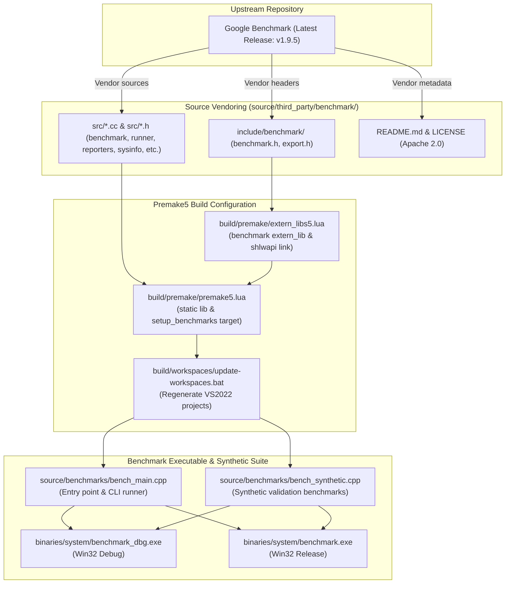

# Plan: Google Benchmark Integration & Validation in 0 A.D.

## Executive Summary

The purpose of this initiative is to integrate the latest version of **Google Benchmark** (**v1.9.5**) into the 0 A.D. (Pyrogenesis) codebase.

Google Benchmark is the industry-standard microbenchmarking support library for C++. Integrating it provides a unified, statistically robust framework for benchmarking engine subsystems, memory layouts, spatial partitioning, data structures, and entity-component architectures.

In accordance with user requirements, this plan is strictly scoped to:
1. Vendoring the latest upstream release of Google Benchmark (**v1.9.5**) into `source/third_party/benchmark/`.
2. Configuring the Premake5 build system (`build/premake/extern_libs5.lua` and `build/premake/premake5.lua`) to compile Google Benchmark as a third-party static library and define a standalone `benchmark` console executable target (`binaries/system/benchmark.exe` and `binaries/system/benchmark_dbg.exe`).
3. Implementing synthetic validation benchmarks (`source/benchmarks/bench_main.cpp` and `source/benchmarks/bench_synthetic.cpp`) covering CPU arithmetic, memory/cache bandwidth, parameterized iteration scaling, custom performance counters, multi-threading synchronization, and 0 A.D. engine type interoperability to validate that the library functions as intended.
4. Validating clean compilation, linkage, and execution across Win32 Debug and Win32 Release configurations with zero regressions on existing test suites.

> [!IMPORTANT]
> This plan **must be reviewed and approved** before any implementation or code modifications are enacted. The `.md` plan file will be committed once approval is granted.

---

## Architecture & Integration Strategy



### Key Highlights of Google Benchmark v1.9.5 for 0 A.D.

1. **High-Precision Timing & Stability**:
   - Automated CPU frequency scaling compensation, cycle counting, and dynamic iteration adjustment to minimize statistical variance.
2. **Anti-Optimization Guarantees**:
   - Built-in `benchmark::DoNotOptimize(...)` and `benchmark::ClobberMemory()` prevent compiler over-optimization (dead-code elimination, loop hoisting, or constant folding).
3. **Workload Parameterization & Custom Counters**:
   - Parameterized sweeps via `->Range(min, max)`, `->DenseRange(...)`, and `->Args(...)`.
   - Custom metric tracking (e.g. `Items/s`, `Bytes/s`, custom hardware counter rates).
4. **Multi-Threaded Scaling Support**:
   - First-class multi-threading evaluation with `->Threads(n)` and thread-synchronization barriers.
5. **Multiple Output Formats**:
   - Tabular console output, JSON output (`--benchmark_format=json`) for automated reporting and CI regression tracking, and CSV export.
6. **Clean External Include Isolation**:
   - Headers isolated via `add_third_party_include_paths("benchmark")` and `BENCHMARK_STATIC_DEFINE` to prevent symbol collisions and suppress third-party compiler warnings.

---

## Detailed Step-by-Step Roadmap (Atomic Changes)

### Phase 1: Source Preparation & Vendoring

**Goal**: Vendor the Google Benchmark v1.9.5 headers, implementation sources, license, and metadata under `source/third_party/benchmark/`.

#### Step 1.1: Vendor Google Benchmark v1.9.5 Headers & Sources
- Fetch upstream release `v1.9.5` from `https://github.com/google/benchmark`.
- Place public headers under `source/third_party/benchmark/include/benchmark/`:
  - `benchmark.h` (primary API header)
  - `export.h` (visibility macro definitions)
- Place core implementation sources and private headers under `source/third_party/benchmark/src/`:
  - Core benchmark logic: `benchmark.cc`, `benchmark_api_internal.cc`, `benchmark_api_internal.h`, `benchmark_name.cc`, `benchmark_register.cc`, `benchmark_register.h`, `benchmark_runner.cc`, `benchmark_runner.h`, `benchmark_main.cc`
  - Diagnostics & timing: `check.cc`, `check.h`, `colorprint.cc`, `colorprint.h`, `commandlineflags.cc`, `commandlineflags.h`, `complexity.cc`, `complexity.h`, `counter.cc`, `counter.h`, `cycleclock.h`, `log.h`, `mutex.h`, `perf_counters.cc`, `perf_counters.h`, `statistics.cc`, `statistics.h`, `string_util.cc`, `string_util.h`, `sysinfo.cc`, `timers.cc`, `timers.h`, `thread_manager.h`, `thread_timer.h`
  - Reporters: `console_reporter.cc`, `csv_reporter.cc`, `json_reporter.cc`, `reporter.cc`
  - Utility headers: `arraysize.h`, `internal_macros.h`, `re.h`

#### Step 1.2: Add Documentation & License
- Create `source/third_party/benchmark/README.md`:
  - Upstream URL: `https://github.com/google/benchmark`
  - Tag/Version: `v1.9.5`
  - License: Apache License 2.0
  - Description and vendoring instructions for future updates
- Create `source/third_party/benchmark/LICENSE`:
  - Full Apache 2.0 license text.

---

### Phase 2: Build System Configuration (Premake5)

**Goal**: Configure Premake5 to build Google Benchmark as a third-party static library, define the standalone `benchmark` executable project, and regenerate Visual Studio 2022 workspaces.

#### Step 2.1: Update `build/premake/extern_libs5.lua`
- Add the `benchmark` external library definition to `extern_lib_defs`:
  ```lua
  benchmark = {
      compile_settings = function()
          add_third_party_include_paths("benchmark")
          defines { "BENCHMARK_STATIC_DEFINE" }
      end,
      link_settings = function()
          if os.istarget("windows") then
              links { "shlwapi" }
          end
      end,
  },
  ```

#### Step 2.2: Update `build/premake/premake5.lua`
- Add `--without-benchmarks` option:
  ```lua
  newoption { category = "Pyrogenesis", trigger = "without-benchmarks", description = "Disable generation of benchmark projects" }
  ```
- In `project_add_contents(...)`, ensure `.cc` source files are recognized alongside `.cpp`:
  ```lua
  files { prefix.."*.cpp", prefix.."*.cc", prefix.."*.h", prefix.."*.inl", prefix.."*.js", prefix.."*.asm", prefix.."*.mm" }
  ```
- In `setup_all_libs()`, define the `benchmark` third-party static library:
  ```lua
  source_dirs = {
      "third_party/benchmark/src",
  }
  extern_libs = {
      "benchmark",
  }
  setup_third_party_static_lib_project("benchmark", source_dirs, extern_libs, { no_pch = 1, no_default_link = 1 })
  removefiles { source_root .. "third_party/benchmark/src/benchmark_main.cc" }
  filter "action:vs*"
      buildoptions {
          "/wd4127",
          "/wd4309",
          "/wd4800",
          "/wd4100",
          "/wd4996",
          "/wd4099",
          "/wd4503",
          "/wd4459"
      }
  filter {}
  ```
- Add the `setup_benchmarks()` function to construct the executable project:
  ```lua
  function setup_benchmarks ()
      local target_type = get_main_project_target_type()
      project_create("benchmark", target_type)

      local source_dirs = {
          "benchmarks",
      }

      project_add_contents(source_root, source_dirs, {}, { no_pch = 1 })

      filter "system:not macosx"
          linkgroups 'On'
      filter {}

      links { static_lib_names }
      filter "Debug"
          links { static_lib_names_debug }
      filter "Release"
          links { static_lib_names_release }
      filter { }

      links { "benchmark" }

      project_add_extern_libs(used_extern_libs, target_type)
      project_add_extern_libs({ "benchmark" }, target_type)

      dependson { "Collada" }

      rtti "off"

      if os.istarget("windows") then
          files { source_root.."lib/sysdep/os/win/error_dialog.rc" }
          linkoptions { "/SUBSYSTEM:CONSOLE" }
          links { "delayimp", "shlwapi" }
          project_add_manifest(arch)
          if arch == "amd64" then
              architecture("x86_64")
          end
      elseif os.istarget("linux") or os.istarget("bsd") then
          if link_execinfo then
              links { "execinfo" }
          end
          if not _OPTIONS["android"] and not (os.getversion().description == "OpenBSD") then
              links { "rt" }
          end
          if os.istarget("linux") or os.getversion().description == "GNU/kFreeBSD" then
              links { "dl" }
              if arch == "riscv64" then
                  links { "atomic" }
              end
          end
          buildoptions { "-pthread" }
          if not _OPTIONS["android"] then
              linkoptions { "-pthread" }
          end
      elseif os.istarget("macosx") then
          architecture(macos_arch)
          buildoptions { "-arch " .. macos_arch }
          linkoptions { "-arch " .. macos_arch }
          xcodebuildsettings { ARCHS = macos_arch }
          if _OPTIONS["macosx-version-min"] then
              xcodebuildsettings { MACOSX_DEPLOYMENT_TARGET = _OPTIONS["macosx-version-min"] }
          end
      end
  end
  ```
- Invoke `setup_benchmarks()` conditional on `not _OPTIONS["without-benchmarks"]`.

#### Step 2.3: Regenerate Workspaces
- Execute [update-workspaces.bat](file:///C:/Users/james/0ad/build/workspaces/update-workspaces.bat) on Windows to regenerate:
  - `build/workspaces/vs2022/benchmark.vcxproj`
  - `build/workspaces/vs2022/pyrogenesis.sln`

---

### Phase 3: Synthetic Benchmark Validation Suite

**Goal**: Implement a clean benchmark runner entry point and a suite of synthetic benchmarks exercising Google Benchmark capabilities and validating engine linkage.

#### Step 3.1: Create Benchmark Entry Point `source/benchmarks/bench_main.cpp`
```cpp
/* Copyright (C) 2026 Wildfire Games.
 * This file is part of 0 A.D.
 *
 * 0 A.D. is free software: you can redistribute it and/or modify
 * it under the terms of the GNU General Public License as published by
 * the Free Software Foundation, either version 2 of the License, or
 * (at your option) any later version.
 */

#include "lib/self_test.h"
#include <benchmark/benchmark.h>
#include <iostream>

int main(int argc, char** argv)
{
    std::cout << "====================================================" << std::endl;
    std::cout << "  0 A.D. (Pyrogenesis) Google Benchmark Suite       " << std::endl;
    std::cout << "  Google Benchmark Version: " << BENCHMARK_VERSION << std::endl;
    std::cout << "====================================================" << std::endl;

    benchmark::Initialize(&argc, argv);
    if (benchmark::ReportUnrecognizedArguments(argc, argv))
        return 1;

    benchmark::RunSpecifiedBenchmarks();
    benchmark::Shutdown();

    return 0;
}
```

#### Step 3.2: Create Synthetic Benchmarks `source/benchmarks/bench_synthetic.cpp`
```cpp
/* Copyright (C) 2026 Wildfire Games.
 * This file is part of 0 A.D.
 *
 * 0 A.D. is free software: you can redistribute it and/or modify
 * it under the terms of the GNU General Public License as published by
 * the Free Software Foundation, either version 2 of the License, or
 * (at your option) any later version.
 */

#include <benchmark/benchmark.h>
#include <numeric>
#include <vector>
#include <string>
#include <cmath>

#include "maths/FixedVector3D.h"
#include "ps/CStr.h"

// 1. Synthetic CPU Arithmetic & Anti-Optimization Validation
static void BM_Synthetic_MathComputation(benchmark::State& state)
{
    int64_t items = 0;
    for (auto _ : state)
    {
        double x = 1.0;
        for (int i = 0; i < 100; ++i)
        {
            x = std::sin(x) + std::cos(x) * 0.5;
            benchmark::DoNotOptimize(x);
        }
        items += 100;
    }
    state.SetItemsProcessed(items);
}
BENCHMARK(BM_Synthetic_MathComputation);

// 2. Synthetic Container & Memory Bandwidth with Range Parameterization
static void BM_Synthetic_VectorAccumulation(benchmark::State& state)
{
    const size_t size = state.range(0);
    std::vector<int64_t> data(size);
    std::iota(data.begin(), data.end(), 1);

    for (auto _ : state)
    {
        int64_t sum = 0;
        for (size_t i = 0; i < size; ++i)
        {
            sum += data[i];
        }
        benchmark::DoNotOptimize(sum);
        benchmark::ClobberMemory();
    }

    state.SetBytesProcessed(int64_t(state.iterations()) * int64_t(size * sizeof(int64_t)));
    state.SetItemsProcessed(int64_t(state.iterations()) * int64_t(size));
}
BENCHMARK(BM_Synthetic_VectorAccumulation)->RangeMultiplier(4)->Range(64, 65536);

// 3. Synthetic Multi-Threaded Contention & Scaling
static void BM_Synthetic_MultiThreadedScaling(benchmark::State& state)
{
    for (auto _ : state)
    {
        uint64_t accumulator = 0;
        for (int i = 0; i < 1000; ++i)
        {
            accumulator += (i * 31) ^ (state.thread_index() + 1);
            benchmark::DoNotOptimize(accumulator);
        }
    }
}
BENCHMARK(BM_Synthetic_MultiThreadedScaling)->ThreadRange(1, 4);

// 4. Synthetic Engine Type Interoperability (CStr & CFixedVector3D)
static void BM_Synthetic_EngineTypesInteroperability(benchmark::State& state)
{
    const int count = state.range(0);
    CFixedVector3D origin(fixed::FromInt(0), fixed::FromInt(0), fixed::FromInt(0));
    CFixedVector3D step(fixed::FromInt(1), fixed::FromInt(2), fixed::FromInt(3));

    for (auto _ : state)
    {
        CFixedVector3D current = origin;
        for (int i = 0; i < count; ++i)
        {
            current += step;
            CStr formatted = CStr::FromInt(current.X.ToInt());
            benchmark::DoNotOptimize(formatted);
            benchmark::DoNotOptimize(current);
        }
    }

    state.SetItemsProcessed(int64_t(state.iterations()) * int64_t(count));
}
BENCHMARK(BM_Synthetic_EngineTypesInteroperability)->Range(10, 1000);
```

#### Step 3.3: Re-run Workspace Generator
- Run `update-workspaces.bat` to include the newly created `source/benchmarks/` files in `build/workspaces/vs2022/benchmark.vcxproj`.

---

### Phase 4: Compilation, Linking & Validation

**Goal**: Validate full compilation, clean linkage, and successful execution across build configurations.

#### Step 4.1: Win32 Debug Build & Execution
1. Build `benchmark` and test suites in **Debug (Win32)**:
   ```powershell
   MSBuild.exe build\workspaces\vs2022\pyrogenesis.sln /p:Configuration=Debug /p:Platform=Win32 /m
   ```
2. Execute `binaries\system\benchmark_dbg.exe`:
   - Validate banner display and Google Benchmark initialization.
   - Confirm all synthetic benchmarks execute and report iterations, time, CPU time, and custom throughput counters.
3. Execute `binaries\system\test_dbg.exe`:
   - Confirm all 481 existing engine tests pass with zero regressions.

#### Step 4.2: Win32 Release Build & Execution
1. Build `benchmark` and test suites in **Release (Win32)**:
   ```powershell
   MSBuild.exe build\workspaces\vs2022\pyrogenesis.sln /p:Configuration=Release /p:Platform=Win32 /m
   ```
2. Execute `binaries\system\benchmark.exe`:
   - Validate full optimized performance.
   - Test JSON output formatting: `binaries\system\benchmark.exe --benchmark_format=json`.
   - Test benchmark filtering: `binaries\system\benchmark.exe --benchmark_filter=BM_Synthetic_MathComputation`.
3. Execute `binaries\system\test.exe`:
   - Confirm all 481 release engine tests pass.

#### Step 4.3: Header & Warning Hygiene Verification
- Confirm zero warnings generated under MSVC (`/W4` / `/external:W0`) and Clang/GCC.
- Verify that `BENCHMARK_STATIC_DEFINE` prevents unwanted DLL import/export attribute warnings.

---

## Planned Git Commits (Atomic & Descriptive)

Following [AGENTS.md](file:///C:/Users/james/0ad/AGENTS.md), changes will be enacted through atomic, incremental commits:

### Commit 1: Source Vendoring
```text
third_party: Vendor Google Benchmark v1.9.5

Vendors the latest upstream release of Google Benchmark (v1.9.5)
under source/third_party/benchmark/ including public headers,
implementation sources, README.md, and LICENSE (Apache 2.0).

Google Benchmark provides a standard, robust microbenchmarking framework
supporting high-precision timing, anti-optimization primitives, custom
performance counters, and multiple reporter formats.
```

### Commit 2: Build System Configuration
```text
build: Configure Premake5 for Google Benchmark and generate workspace projects

- Add 'benchmark' external library definition in build/premake/extern_libs5.lua
  with BENCHMARK_STATIC_DEFINE and Windows shlwapi link.
- Update build/premake/premake5.lua to support .cc files in source trees.
- Add 'benchmark' static library project for third-party sources.
- Add 'benchmark' standalone executable project targeting binaries/system/benchmark.exe.
- Regenerate Visual Studio 2022 workspace and project files.
```

### Commit 3: Synthetic Benchmark Suite
```text
benchmarks: Add synthetic benchmark suite to validate Google Benchmark integration

Implements the benchmark executable entry point and synthetic validation benchmarks:
- bench_main.cpp: Command-line initialization and benchmark runner execution.
- bench_synthetic.cpp: Synthetic benchmarks validating CPU arithmetic with
  DoNotOptimize, memory/cache bandwidth with parameterized range multipliers,
  multi-threaded scaling, and 0 A.D. engine types (CStr, CFixedVector3D) interoperability.

Regenerates workspace projects to include new benchmark sources.
```

### Commit 4: Plan Documentation
```text
docs: Add Google Benchmark v1.9.5 integration and validation plan

Adds the reviewed and approved technical plan outlining the integration
and validation of Google Benchmark v1.9.5 within 0 A.D.
```

---

## Verification & Quality Gates

Before submission, each of the following criteria must be satisfied:

| Check | Requirement | Target Status |
| :--- | :--- | :--- |
| **Plan Review** | Plan reviewed and approved by user | ⏳ Awaiting Review |
| **Clean Headers** | Google Benchmark v1.9.5 vendored with Apache 2.0 license & README | Pending Approval |
| **Build System** | Premake5 builds clean static lib & executable without errors | Pending Approval |
| **Win32 Debug** | `benchmark_dbg.exe`, `pyrogenesis_dbg.exe`, `test_dbg.exe` build cleanly | Pending Approval |
| **Win32 Release** | `benchmark.exe`, `pyrogenesis.exe`, `test.exe` build cleanly | Pending Approval |
| **Synthetic Suite** | `benchmark.exe` executes all synthetic benchmarks successfully | Pending Approval |
| **Test Suite** | `test_dbg.exe` and `test.exe` pass all 481 unit tests (zero regressions) | Pending Approval |
| **Working Tree** | Untracked temporary files cleaned up (`git clean` / `checkout`) | Pending Approval |

---

## Review & Approval Request

This integration plan is complete, strictly scoped to library integration and synthetic validation, and targets the latest Google Benchmark release (**v1.9.5**).

**No code, library files, or project files have been modified yet.**
Please review the plan. Once approved, the plan `.md` file will be committed and implementation can proceed.
