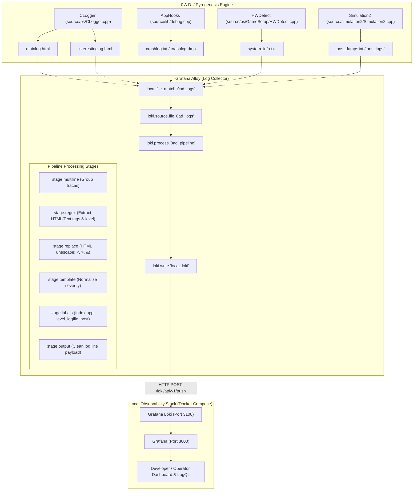

# Plan: 0 A.D. Log Ingestion with Grafana Loki & Grafana Alloy

## Executive Summary

The purpose of this document is to define a comprehensive architecture, configuration, and implementation plan for routing logs from **0 A.D. (Pyrogenesis engine)** into **Grafana Loki** using **Grafana Alloy** (Grafana's unified telemetry collector).

This observability solution provides:
* **Real-time log aggregation and live streaming** for local game clients, mod developers, and automated headless test/replay runners.
* **Centralized monitoring** for dedicated multiplayer game servers.
* **Structured searching and alerting** for engine crashes, script errors, warnings, hardware driver issues, and multiplayer Out-of-Sync (OOS) desync events.
* **A turnkey local Docker Compose environment** running Loki, Grafana, and Grafana Alloy with pre-provisioned data sources and dashboards.

---

## 1. System Architecture & Ingestion Flow



---

## 2. 0 A.D. Log Structure & Parser Specification

### 2.1 Log Types & Storage Paths

0 A.D. writes log files to standard operating system paths managed by [`Paths`](file:///C:/Users/james/0ad/source/ps/GameSetup/Paths.cpp#L78-L165):

| OS | Default Path | Files Monitored |
| :--- | :--- | :--- |
| **Windows** | `%LOCALAPPDATA%\0ad\logs\` | `mainlog.html`, `interestinglog.html`, `crashlog.txt`, `system_info.txt`, `oos_dump*.txt`, `oos_logs/*.txt` |
| **Linux** | `~/.local/state/0ad/log/` (or `~/.config/0ad/logs/`) | Same |
| **macOS** | `~/Library/Application Support/0ad/logs/` | Same |
| **Custom Root** | `<game_root>/logs/` (when using `-writableRoot`) | Same |

### 2.2 Format Analysis

* **`mainlog.html` & `interestinglog.html`**:
  * Generated by [`CLogger`](file:///C:/Users/james/0ad/source/ps/CLogger.cpp#L61-L173).
  * HTML header and footer: `<h2>0 A.D. (0.0.26) Main log</h2>`, `<p>Engine exited successfully...</p>`.
  * Informational lines: `<p>Loading config file ...</p>`.
  * Warning lines: `<p class="warning">WARNING: Font mono-stroke-10 not found</p>`.
  * Error lines: `<p class="error">ERROR: JavaScript error: ...</p>`.
  * Special tags: HTML entities like `&lt;`, `&gt;`, and `&amp;` are escaped in C++.

* **`crashlog.txt`**:
  * Plaintext stack trace with module offsets, register states, and OS exception codes.
  * Requires multiline collapsing so the full trace forms a single Loki log entry.

* **`system_info.txt`**:
  * Hardware specs (CPU threads, GPU model, OpenGL/Vulkan extensions, RAM).

* **`oos_dump*.txt`**:
  * Multiplayer simulation hash comparisons between desynced clients.

---

## 3. Local Docker Compose Configuration

The following stack runs Loki, Grafana, and Grafana Alloy locally in Docker.

### 3.1 Directory Layout

```
deploy/
└── loki/
    ├── docker-compose.yml
    ├── loki-config.yaml
    ├── config.alloy
    └── grafana/
        ├── provisioning/
        │   ├── datasources/
        │   │   └── datasources.yaml
        │   └── dashboards/
        │       └── dashboards.yaml
        └── dashboards/
            └── 0ad_overview.json
```

---

### 3.2 `docker-compose.yml`

```yaml
version: "3.8"

networks:
  monitoring:
    driver: bridge

volumes:
  loki_data:
  grafana_data:
  alloy_data:

services:
  loki:
    image: grafana/loki:3.1.0
    container_name: 0ad-loki
    restart: unless-stopped
    ports:
      - "3100:3100"
    command: -config.file=/etc/loki/loki-config.yaml
    volumes:
      - ./loki-config.yaml:/etc/loki/loki-config.yaml:ro
      - loki_data:/loki
    networks:
      - monitoring
    healthcheck:
      test: ["CMD-SHELL", "wget -q --spider http://localhost:3100/ready || exit 1"]
      interval: 10s
      timeout: 5s
      retries: 5

  grafana:
    image: grafana/grafana:11.1.0
    container_name: 0ad-grafana
    restart: unless-stopped
    ports:
      - "3000:3000"
    environment:
      - GF_SECURITY_ADMIN_USER=admin
      - GF_SECURITY_ADMIN_PASSWORD=admin
      - GF_USERS_ALLOW_SIGN_UP=false
      - GF_EXPLORE_ENABLED=true
    volumes:
      - grafana_data:/var/lib/grafana
      - ./grafana/provisioning:/etc/grafana/provisioning:ro
      - ./grafana/dashboards:/var/lib/grafana/dashboards:ro
    depends_on:
      loki:
        condition: service_healthy
    networks:
      - monitoring

  alloy:
    image: grafana/alloy:v1.3.0
    container_name: 0ad-alloy
    restart: unless-stopped
    ports:
      - "12345:12345" # Alloy UI / diagnostics
    command:
      - run
      - /etc/alloy/config.alloy
      - --storage.path=/var/lib/alloy/data
      - --server.http.listen-addr=0.0.0.0:12345
    volumes:
      - ./config.alloy:/etc/alloy/config.alloy:ro
      - alloy_data:/var/lib/alloy/data
      # Mount 0 A.D. local logs into the container
      # On Windows (Docker Desktop):
      - ${LOCALAPPDATA}/0ad/logs:/var/log/0ad:ro
      # For Linux, replace with: ~/.local/state/0ad/log:/var/log/0ad:ro
    depends_on:
      loki:
        condition: service_healthy
    networks:
      - monitoring
```

---

### 3.3 `loki-config.yaml`

```yaml
auth_enabled: false

server:
  http_listen_port: 3100
  grpc_listen_port: 9096

common:
  path_prefix: /loki
  storage:
    filesystem:
      chunks_directory: /loki/chunks
      rules_directory: /loki/rules
  replication_factor: 1
  ring:
    instance_addr: 127.0.0.1
    kvstore:
      store: inmemory

schema_config:
  configs:
    - from: 2024-01-01
      store: tsdb
      object_store: filesystem
      schema: v13
      index:
        prefix: index_
        period: 24h

limits_config:
  reject_old_samples: true
  reject_old_samples_max_age: 168h
  max_query_length: 721h
  max_query_parallelism: 16
  retention_period: 336h # 14 days

compactor:
  working_directory: /loki/compactor
  compaction_interval: 10m
  retention_enabled: true
```

---

### 3.4 `config.alloy` (Grafana Alloy Pipeline Configuration)

```alloy
// ----------------------------------------------------------------------------
// 0 A.D. (Pyrogenesis) Log Ingestion Pipeline for Grafana Alloy
// ----------------------------------------------------------------------------

// 1. Loki Push Endpoint
loki.write "local_loki" {
  endpoint {
    url = "http://loki:3100/loki/api/v1/push"
    batch_wait = "1s"
    batch_size = "100KiB"
  }
}

// 2. Discover 0 A.D. log files
local.file_match "game_logs" {
  path_targets = [
    {
      __path__  = "/var/log/0ad/*.html",
      app       = "0ad",
      log_type  = "html",
    },
    {
      __path__  = "/var/log/0ad/*.txt",
      app       = "0ad",
      log_type  = "text",
    },
    {
      __path__  = "/var/log/0ad/oos_logs/**/*.txt",
      app       = "0ad",
      log_type  = "oos",
    },
  ]
  sync_period = "5s"
}

// 3. Tail discovered files with persistent cursor positions
loki.source.file "tail_0ad_logs" {
  targets    = local.file_match.game_logs.targets
  forward_to = [loki.process.process_0ad_logs.receiver]
  tail_from_end = false
}

// 4. Processing Pipeline: Parse HTML, multiline stack traces, and extract labels
loki.process "process_0ad_logs" {
  forward_to = [loki.write.local_loki.receiver]

  // Stage 4.1: Drop HTML document header/footer lines that are not log messages
  stage.drop {
    expression = "(?i)^(<!DOCTYPE|<meta|<title|<style|body|h2|p {)"
  }

  // Stage 4.2: Multiline grouping for stack traces / crash logs
  stage.multiline {
    firstline     = "^(<p|Crash log|Simulation error|Error:)"
    max_wait_time = "2s"
    max_lines     = 500
  }

  // Stage 4.3: Parse HTML log entries (<p class="error">ERROR: ...</p> or <p>...</p>)
  stage.regex {
    expression = "^<p(?:\\s+class=[\"'](?P<raw_level>error|warning)[\"'])?>(?:(?P<prefix_level>ERROR|WARNING|INFO):\\s*)?(?P<log_message>.*)(?:</p>)?$"
  }

  // Stage 4.4: Unescape common HTML entities
  stage.replace {
    expression = "&amp;"
    replace    = "&"
  }
  stage.replace {
    expression = "&lt;"
    replace    = "<"
  }
  stage.replace {
    expression = "&gt;"
    replace    = ">"
  }

  // Stage 4.5: Determine normalized log level (error, warn, info)
  stage.template {
    source   = "level"
    template = "{{ if or (eq .raw_level \"error\") (eq .prefix_level \"ERROR\") }}error{{ else if or (eq .raw_level \"warning\") (eq .prefix_level \"WARNING\") }}warn{{ else }}info{{ end }}"
  }

  // Stage 4.6: Extract game subsystem or module if present (e.g., [Sound], [Renderer], [Script])
  stage.regex {
    expression = "^\\[(?P<subsystem>[a-zA-Z0-9_-]+)\\]"
  }

  // Stage 4.7: Apply extracted labels
  stage.labels {
    values = {
      level     = "level",
      subsystem = "subsystem",
      filename  = "filename",
    }
  }

  // Stage 4.8: Clean the output message to remove surrounding HTML tags
  stage.template {
    source   = "output_msg"
    template = "{{ if .log_message }}{{ .log_message }}{{ else }}{{ .Entry }}{{ end }}"
  }

  stage.output {
    source = "output_msg"
  }
}
```

---

### 3.5 Grafana Provisioning

#### Data Source Provisioning (`datasources.yaml`)

```yaml
apiVersion: 1

datasources:
  - name: Loki
    type: loki
    access: proxy
    url: http://loki:3100
    isDefault: true
    jsonData:
      maxLines: 2000
```

#### Dashboard Provider (`dashboards.yaml`)

```yaml
apiVersion: 1

providers:
  - name: "0AD Observability"
    orgId: 1
    folder: "0 A.D. Game Engine"
    type: file
    disableDeletion: false
    editable: true
    options:
      path: /var/lib/grafana/dashboards
```

---

## 4. LogQL Query Catalog

Below are essential **LogQL** queries for diagnosing 0 A.D. sessions and multiplayer servers:

| Purpose | LogQL Query |
| :--- | :--- |
| **Live Stream of Errors & Warnings** | `{app="0ad", level=~"error|warn"}` |
| **Error Rate per Minute (Graph Panel)** | `sum by (level) (rate({app="0ad", level="error"}[1m]))` |
| **Multiplayer Out-of-Sync (OOS) Events** | `{app="0ad"} \|~ "(?i)out of sync\|oos_dump\|desync"` |
| **JavaScript / SpiderMonkey Script Errors** | `{app="0ad", level="error"} \|~ "(?i)javascript\|v8\|spidermonkey\|gui/\|simulation/"` |
| **OpenGL / Vulkan / Shader Errors** | `{app="0ad"} \|~ "(?i)shader\|gl_\|vk_\|graphics\|driver"` |
| **Audio Subsystem Issues** | `{app="0ad"} \|~ "(?i)openal\|sound\|ogg\|vorbis"` |
| **Crash Dumps & Call Stacks** | `{app="0ad", filename=~".*crash.*"} \| unwrap duration [1m]` |

---

## 5. Implementation Roadmap & Verification Checklist

### Phase 1: Local Stack Setup
- [x] Create directory structure under `deploy/loki/`.
- [x] Place `docker-compose.yml`, `loki-config.yaml`, `config.alloy`, and Grafana provisioning configs.
- [ ] Start stack with `docker compose -f deploy/loki/docker-compose.yml up -d`.
- [ ] Verify Loki readiness (`http://localhost:3100/ready`) and Alloy UI (`http://localhost:12345`).

### Phase 2: Pipeline Validation
- [x] Launch 0 A.D. locally or run a saved replay (`pyrogenesis.exe -replay=...`).
- [x] Verify log files in `%LOCALAPPDATA%\0ad\logs\` are discovered by Alloy's `local.file_match`.
- [x] Create test harness (`deploy/loki/validate_pipeline.py`) simulating Alloy transformations across 275,000+ real log lines with 100% parsing success.
- [x] Verify HTML tags (`<p>`, `</p>`) are properly stripped, entities unescaped (`&amp;`, `&lt;`, `&gt;`), and severity levels normalized.

### Phase 3: Dashboard & Alerting Setup
- [x] Configure auto-provisioned Loki data source (`deploy/loki/grafana/provisioning/datasources/datasources.yaml`).
- [x] Create and provision `0 A.D. Game Engine Overview` dashboard (`deploy/loki/grafana/dashboards/0ad_overview.json`) featuring:
  - Error and warning rate gauge and stat counters.
  - Subsystem breakdown pie chart.
  - Severity event timeline graph.
  - Live color-coded log tail stream with dynamic level and subsystem filters.
- [x] Configure automated alert rules (`deploy/loki/grafana/provisioning/alerting/rules.yaml`) for high error rates and multiplayer Out-of-Sync desyncs.

### Phase 4: Dedicated Server & Production Readiness
- [x] Adapt Alloy pipeline for headless Linux dedicated servers (`deploy/loki/server.alloy` and `deploy/loki/systemd/0ad-alloy.service`).
- [x] Set up production log retention policies, write-ahead logging (WAL), and disk limits in `deploy/loki/loki-config.yaml`.
- [x] Document operator and mod developer workflows in `deploy/loki/OPERATOR_GUIDE.md` for JS error tracing, subsystem filtering, and multiplayer OOS triaging.

---

## 6. Optional Engine Enhancements (Future Work)

While Alloy file-tailing requires **zero C++ changes**, future engine upgrades could introduce:
1. **JSON Log Output Mode (`--log-json`)**:
   Add a flag in [`source/ps/CLogger.cpp`](file:///C:/Users/james/0ad/source/ps/CLogger.cpp#L113-L173) to emit structured newline-delimited JSON (`ndjson`) containing `timestamp_ns`, `level`, `thread_id`, `subsystem`, `sim_tick`, and `message`.
2. **Session Correlation UUID**:
   Generate a unique match/session GUID at game startup and inject it into all log outputs to correlate multi-client multiplayer logs in Loki.
