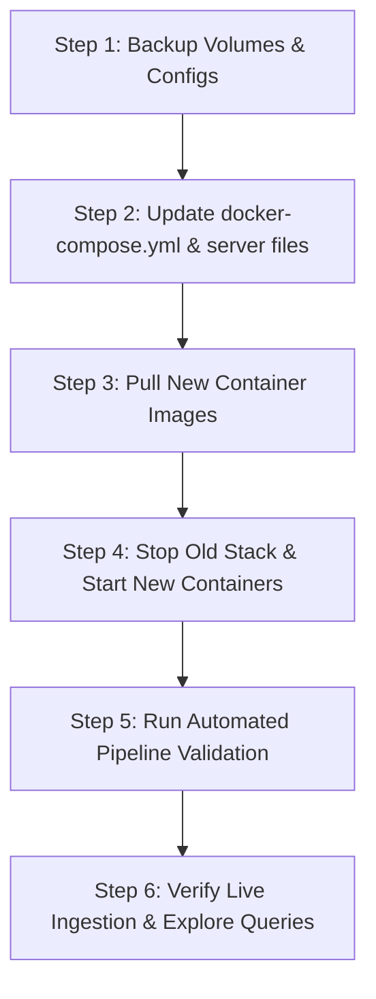

# Grafana / Loki / Alloy Stack Upgrade Plan

This plan outlines the procedure to upgrade the containerized 0 A.D. observability stack from its current baseline to the latest stable production releases.

---

## 1. Version Upgrade Matrix

| Component | Current Version | Target Version | Image Repository | Notes / Key Changes |
| :--- | :--- | :--- | :--- | :--- |
| **Grafana** | `11.1.0` | `13.2.0` | `grafana/grafana-enterprise` (or `grafana/grafana`) | New Explore UI, enhanced LogQL autocompletion, dashboard schema updates. |
| **Loki** | `3.1.0` | `3.7.6` | `grafana/loki` | TSDB v13 schema improvements, enhanced structured metadata handling, index compaction enhancements. |
| **Grafana Alloy** | `v1.3.0` | `v1.18.1` | `grafana/alloy` | Alloy syntax stability, enhanced file tailing cursor reliability, memory optimizations. |

---

## 2. Pre-Upgrade Checks & Compatibility

1. **Docker Compose Syntax**:
   - The root attribute `version: "3.8"` in [docker-compose.yml](file:///C:/Users/james/0ad/deploy/loki/docker-compose.yml#L1) is obsolete in modern Compose and should be removed.
2. **Loki Storage Schema Compatibility**:
   - Existing storage uses TSDB (`schema: v13`) in [loki-config.yaml](file:///C:/Users/james/0ad/deploy/loki/loki-config.yaml#L21-L28).
   - TSDB v13 is forward-compatible with Loki 3.7+.
3. **Grafana Alloy Configuration**:
   - The pipeline stages (`local.file_match`, `loki.source.file`, `loki.process`, `stage.drop`, `stage.multiline`, `stage.regex`, `stage.replace`, `stage.template`, `stage.labels`, `stage.output`) in [config.alloy](file:///C:/Users/james/0ad/deploy/loki/config.alloy) and [server.alloy](file:///C:/Users/james/0ad/deploy/loki/server.alloy) remain supported in Alloy v1.18.1.
4. **Volume Data Persistence**:
   - `loki_data`, `grafana_data`, and `alloy_data` named volumes will persist existing indexes, dashboard states, and cursor positions across container rebuilds.

---

## 3. Step-by-Step Execution Plan



### Phase 1: Preparation & Backup
1. **Ensure Stack is Stopped**:
   ```powershell
   docker compose -f deploy/loki/docker-compose.yml down
   ```
2. **(Optional) Backup persistent volume data**:
   - Backup `grafana_data` and `loki_data` named volumes if long-term historical logs need to be preserved before schema migration.

### Phase 2: Update Configuration Files
1. **Update [deploy/loki/docker-compose.yml](file:///C:/Users/james/0ad/deploy/loki/docker-compose.yml)**:
   - Remove obsolete `version: "3.8"` line.
   - Update image tags:
     - `grafana/loki:3.7.6`
     - `grafana/grafana:13.2.0` (or `grafana/grafana-enterprise:13.2.0`)
     - `grafana/alloy:v1.18.1`
2. **Review & Update Documentation**:
   - Update version references in [deploy/loki/README.md](file:///C:/Users/james/0ad/deploy/loki/README.md) and [deploy/loki/OPERATOR_GUIDE.md](file:///C:/Users/james/0ad/deploy/loki/OPERATOR_GUIDE.md).

### Phase 3: Deployment & Startup
1. **Pre-pull images**:
   ```powershell
   docker compose -f deploy/loki/docker-compose.yml pull
   ```
2. **Start the upgraded stack**:
   ```powershell
   docker compose -f deploy/loki/docker-compose.yml up -d
   ```
3. **Verify container health**:
   ```powershell
   docker compose -f deploy/loki/docker-compose.yml ps
   ```

---

## 4. Verification & Testing Procedure

1. **Automated Pipeline Validation**:
   - Execute the test script:
     ```powershell
     python deploy/loki/validate_pipeline.py
     ```
2. **Health Endpoints**:
   - Loki ready check: `curl http://localhost:3100/ready` (expect `ready`)
   - Alloy UI: [http://localhost:12345](http://localhost:12345) (verify components show healthy green status)
   - Grafana UI: [http://localhost:3000](http://localhost:3000) (verify login `admin`/`admin`)
3. **Log Ingestion & Stream Validation**:
   - Check that `mainlog.html`, `interestinglog.html`, and `oos_logs` are tailing without parse errors:
     ```powershell
     docker exec 0ad-alloy alloy -v
     docker exec 0ad-loki loki -version
     ```
   - In Grafana Explore, execute:
     ```logql
     {app="0ad"}
     ```
4. **Provisioned Dashboards & Alert Rules**:
   - Open **0 A.D. Engine Observability** dashboard.
   - Verify all panels (Log Stream, Error Rate, Subsystem Distribution) populate correctly without schema errors.

---

## 5. Rollback Plan

If any breaking changes or unexpected service errors occur:
1. Revert container image tags in `deploy/loki/docker-compose.yml` back to `loki:3.1.0`, `grafana:11.1.0`, and `alloy:v1.3.0`.
2. Restart the containers:
   ```powershell
   docker compose -f deploy/loki/docker-compose.yml down
   docker compose -f deploy/loki/docker-compose.yml up -d
   ```
