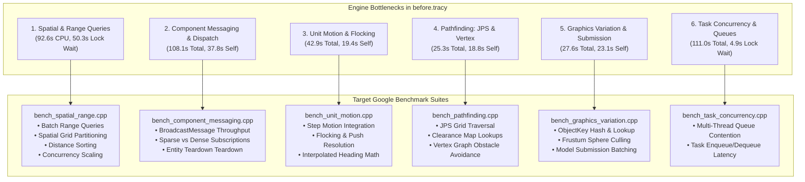
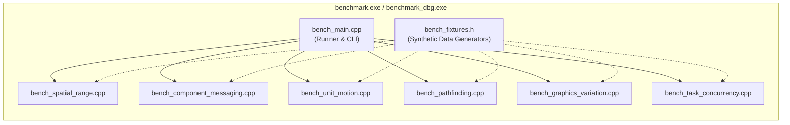

# Plan: Hot-Loop & Bottleneck Benchmark Suite Implementation

## Executive Summary

This document presents the performance analysis of the profiling capture `before.tracy` (captured from `pyrogenesis.exe` during an active simulation session) using the Tracy Profiler MCP, and outlines a comprehensive, atomic implementation plan for building dedicated Google Benchmark suites to exercise, isolate, and measure the identified hot loops and bottlenecks.

The profiling capture recorded **255.41 seconds** of continuous simulation and rendering across **5,455 graphics frames** and **11,302 simulation turns** on a 24-core host machine.

### Key Telemetry Summary
- **Total Capture Duration**: 255.41 s (255,408,187,570 ns)
- **Graphics Frame Time**: Average **48.03 ms** (~20.8 FPS), 50th percentile **32.24 ms**, 90th percentile **96.54 ms**, 99th percentile **167.47 ms**
- **Simulation Turn Duration**: Average **15.39 ms**, 50th percentile **10.80 ms**, 90th percentile **31.46 ms**, 99th percentile **65.37 ms**
- **Total Zone Executions**: 8,058,430 instrumented zone events
- **Lock Contention**: Over **55.4 seconds** of aggregate mutex wait time across worker threads

> [!IMPORTANT]
> **Review & Approval Protocol**: In accordance with project rules, this plan **must be formally reviewed and approved** before any implementation or source code modifications are enacted. Once approved, this plan will be committed to the branch.

---

## Empirical Analysis of `before.tracy`

### 1. Primary Hot Zones & Exclusive Self-Time Breakdown

The table below details the top hot zones ranked by exclusive self-time (time spent within the zone excluding instrumented child zones), along with their invocation counts, average durations, and source locations.

| Rank | Zone Name | Subsystem / Function | Source Location | Invocations | Exclusive Self-Time | Total Inclusive Time | Avg Duration |
|:---:|---|---|---|:---:|:---:|:---:|:---:|
| 1 | `Async range query execution` | [CCmpRangeManager::ExecuteActiveQueries](file:///C:/Users/james/0ad/source/simulation2/components/CCmpRangeManager.cpp#L1207) | `CCmpRangeManager.cpp:1207` | 271,248 | **92,586.91 ms** (36.2%) | 92,586.91 ms | 341.34 µs |
| 2 | `Task Execution` | [Threading::WorkerThread::RunUntilDeath](file:///C:/Users/james/0ad/source/ps/TaskManager.cpp#L287) | `TaskManager.cpp:287` | 425,190 | **81,903.44 ms** (32.1%) | 111,031.71 ms | 261.13 µs |
| 3 | `BroadcastMessage` | [CComponentManager::BroadcastMessage](file:///C:/Users/james/0ad/source/simulation2/system/ComponentManager.cpp#L1077) | `ComponentManager.cpp:1077` | 72,771 | **37,802.96 ms** (14.8%) | 108,101.33 ms | 1,485.50 µs |
| 4 | `frame` (Main Loop) | [Frame](file:///C:/Users/james/0ad/source/main.cpp#L367) | `main.cpp:367` | 5,452 | **19,721.85 ms** (7.7%) | 253,409.98 ms | 46.48 ms |
| 5 | `UnitRenderer::RenderSubmit` | [CCmpUnitRenderer::RenderSubmit](file:///C:/Users/james/0ad/source/simulation2/components/CCmpUnitRenderer.cpp#L399) | `CCmpUnitRenderer.cpp:399` | 11,530 | **16,075.67 ms** (6.3%) | 16,303.63 ms | 1,414.02 µs |
| 6 | `MotionMgr_PostMove` | [CCmpUnitMotionManager::Move](file:///C:/Users/james/0ad/source/simulation2/components/CCmpUnitMotion_System.cpp#L644) | `CCmpUnitMotion_System.cpp:644` | 22,604 | **15,242.34 ms** (6.0%) | 17,824.97 ms | 788.58 µs |
| 7 | `Shared ApplyEntitiesDelta` | Script Interface | `Script:0` | 11,302 | **14,679.07 ms** (5.7%) | 14,679.07 ms | 1,298.80 µs |
| 8 | `onUpdate` | Script Interface | `Script:0` | 11,302 | **14,289.90 ms** (5.6%) | 14,289.90 ms | 1,264.37 µs |
| 9 | `Headquarters update` | Script Interface (AI HQ) | `Script:0` | 2,828 | **13,424.02 ms** (5.3%) | 23,094.98 ms | 8,166.54 µs |
| 10 | `ComputePathJPS` | [LongPathfinder::ComputeJPSPath](file:///C:/Users/james/0ad/source/simulation2/helpers/LongPathfinder.cpp#L727) | `LongPathfinder.cpp:727` | 111,661 | **10,103.33 ms** (3.9%) | 12,424.91 ms | 111.27 µs |
| 11 | `Defense Manager` | Script Interface (AI Defense) | `Script:0` | 2,828 | **8,187.97 ms** (3.2%) | 8,187.97 ms | 2,895.32 µs |
| 12 | `sim update` | [CSimulation2Impl::Update](file:///C:/Users/james/0ad/source/simulation2/Simulation2.cpp#L385) | `Simulation2.cpp:385` | 11,302 | **7,647.01 ms** (3.0%) | 173,345.99 ms | 15.34 ms |
| 13 | `FindObjectVariation` | [CObjectManager::FindObjectVariation](file:///C:/Users/james/0ad/source/graphics/ObjectManager.cpp#L125) | `ObjectManager.cpp:125` | 508,340 | **7,007.86 ms** (2.7%) | 11,261.71 ms | 22.15 µs |
| 14 | `Shared ApplyTemplatesDelta`| Script Interface | `Script:0` | 11,303 | **6,608.21 ms** (2.6%) | 6,608.21 ms | 584.64 µs |
| 15 | `ComputeShortPath` | [VertexPathfinder::ComputeShortPath](file:///C:/Users/james/0ad/source/simulation2/helpers/VertexPathfinder.cpp#L561) | `VertexPathfinder.cpp:561` | 72,627 | **6,122.94 ms** (2.4%) | 7,417.79 ms | 102.14 µs |
| 16 | `Flush Destroyed Components`| [CComponentManager::FlushDestroyedComponents](file:///C:/Users/james/0ad/source/simulation2/system/ComponentManager.cpp#L940) | `ComponentManager.cpp:940` | 26,883 | **5,886.88 ms** (2.3%) | 8,040.24 ms | 299.08 µs |
| 17 | `ExecuteActiveQueries` | [CCmpRangeManager::ExecuteActiveQueries](file:///C:/Users/james/0ad/source/simulation2/components/CCmpRangeManager.cpp#L1192) | `CCmpRangeManager.cpp:1192` | 11,302 | **5,537.52 ms** (2.2%) | 9,620.06 ms | 851.18 µs |
| 18 | `rendering bucketed submissions` | [ModelRenderer::Render](file:///C:/Users/james/0ad/source/renderer/ModelRenderer.cpp#L510) | `ModelRenderer.cpp:510` | 79,164 | **5,368.58 ms** (2.1%) | 5,416.40 ms | 68.42 µs |
| 19 | `UnitRenderer::Interpolate` | [CCmpUnitRenderer::Interpolate](file:///C:/Users/james/0ad/source/simulation2/components/CCmpUnitRenderer.cpp#L355) | `CCmpUnitRenderer.cpp:355` | 4,277 | **4,302.74 ms** (1.7%) | 4,302.74 ms | 1,006.02 µs |
| 20 | `Move` | [CCmpUnitMotion::Move](file:///C:/Users/james/0ad/source/simulation2/components/CCmpUnitMotion.h#L1094) | `CCmpUnitMotion.h:1094` | 1,555,017 | **4,166.94 ms** (1.6%) | 4,166.94 ms | 2.68 µs |
| 21 | `SendRequestedPaths` | [CCmpPathfinder::SendRequestedPaths](file:///C:/Users/james/0ad/source/simulation2/components/CCmpPathfinder.cpp#L821) | `CCmpPathfinder.cpp:821` | 33,906 | **3,762.28 ms** (1.5%) | 5,419.85 ms | 159.85 µs |
| 22 | `FindWalkAndFightTargets` | Script Interface | `Script:0` | 18,665 | **3,441.20 ms** (1.3%) | 3,928.81 ms | 210.49 µs |
| 23 | `MakeGoalReachable` | [HierarchicalPathfinder::MakeGoalReachable](file:///C:/Users/james/0ad/source/simulation2/helpers/HierarchicalPathfinder.cpp#L691) | `HierarchicalPathfinder.cpp:691` | 111,661 | **2,615.64 ms** (1.0%) | 2,615.64 ms | 23.42 µs |
| 24 | `MaybeIncrementalGC` | [ScriptContext::MaybeIncrementalGC](file:///C:/Users/james/0ad/source/scriptinterface/Context.cpp#L320) | `Context.cpp:320` | 16,754 | **2,578.70 ms** (1.0%) | 2,578.70 ms | 153.92 µs |
| 25 | `LosUpdateHelperIncremental`| [CCmpRangeManager::LosUpdateHelperIncremental](file:///C:/Users/james/0ad/source/simulation2/components/CCmpRangeManager.cpp#L2577) | `CCmpRangeManager.cpp:2577` | 1,768,519 | **2,256.07 ms** (0.9%) | 2,256.07 ms | 1.28 µs |

---

### 2. Lock Contention & Concurrency Bottlenecks

Telemetry inspection of `get_lock_wait_stats()` reveals severe lock contention, specifically on spatial range query workers and task manager scheduling queues:

| Lock Name | Contention Events | Total Wait Time | Avg Wait Time | Threads Involved | Root Cause / Impact |
|---|:---:|:---:|:---:|:---:|---|
| **`RangeManager QueryMutex`** | **4,734,871** | **50,316.44 ms** (50.32 s) | 10.63 µs | 24 threads | Fine-grained per-query mutex locking inside the worker loop (`while(true) { lock_guard lg(m_QueryMutex); ... }`) across 24 worker threads. |
| **`TaskManager NormalQueue`** | **972,690** | **4,908.68 ms** (4.91 s) | 5.05 µs | 24 threads | Heavy worker contention on central FIFO task queue when popping asynchronous pathfinding and range query jobs. |
| **`TaskManager LowPriorityQueue`** | **123,900** | **127.53 ms** | 1.03 µs | 24 threads | Worker queue polling contention on low priority tasks. |
| **`SoundManager WorkerMutex`** | **106,654** | **29.07 ms** | 0.27 µs | 2 threads | Main thread vs sound worker synchronization. |
| **`SoundManager DeadItemsMutex`** | **102,894** | **6.71 ms** | 0.07 µs | 2 threads | Audio item disposal tracking. |

---

### 3. Detailed Root Cause Analysis by Subsystem

#### A. Spatial Partitioning & Range Queries (`CCmpRangeManager`)
- **Symptoms**: `Async range query execution` consumed 92.59 s across 271,248 calls. In parallel, `RangeManager QueryMutex` suffered **4.73 million contentions** totaling 50.32 s of blocked thread time.
- **Root Cause**:
  1. **Lock Granularity**: `ExecuteActiveQueries` assigns single queries iteratively inside a `while(true)` loop protected by `std::lock_guard lg(m_QueryMutex);`. With 24 worker threads, threads spend massive cycles contending for single query iterators.
  2. **Set Difference & Distance Sorting**: For each query match, `std::set_difference` and `std::stable_sort(..., EntityDistanceOrdering)` are executed over heap-allocated vectors, generating significant cache thrashing and memory traffic.
  3. **High Frequency LOS Updates**: `LosUpdateHelperIncremental` was called 1.77 million times (2.26 s self-time).

#### B. Component Messaging & Entity Lifecycle (`CComponentManager`)
- **Symptoms**: `BroadcastMessage` consumed 108.10 s total (37.80 s self-time) over 72,771 dispatches. `Flush Destroyed Components` consumed 8.04 s over 26,883 calls.
- **Root Cause**:
  1. **Red-Black Tree Pointer Chasing**: `BroadcastMessage` retrieves component handlers via `std::map<MessageTypeId, ...>` and `std::map<entity_id_t, IComponent*>`. Every broadcast forces non-contiguous tree node traversals across hundreds of entities.
  2. **High-Frequency Broadcasters**: `RenderSubmit`, `TurnStart`, `Update`, `Update_MotionFormation`, `Update_MotionUnit`, and `Interpolate` are broadcast every turn/frame.
  3. **Entity Teardown Complexity**: `FlushDestroyedComponents` performs an exhaustive loop over all registered component types (`m_ComponentsByTypeId`), looking up each entity in nested maps and erasing entries individually.

#### C. Unit Motion, Steering & Flocking (`CCmpUnitMotion_System`, `CCmpUnitMotion`)
- **Symptoms**: `MotionMgr_PostMove` (15.24 s self), `MotionMgr_Move` (25.10 s total), and `CCmpUnitMotion::Move` (4.17 s self, 1.55M calls).
- **Root Cause**:
  1. **Per-Unit Motion Integration**: Each moving unit performs trigonometric heading recalculations, speed updates, obstacle filter checks, and position component synchronization.
  2. **Unit Pushing & Grid Collision Resolution**: Iterative grid-based pushing resolution (`Push`) computes pairwise unit displacement vectors across active units.

#### D. Pathfinding Pipeline (`LongPathfinder`, `VertexPathfinder`, `HierarchicalPathfinder`)
- **Symptoms**: `ComputePathJPS` (10.10 s self, 111,661 calls), `ComputeShortPath` (6.12 s self, 72,627 calls), and `MakeGoalReachable` (2.62 s self).
- **Root Cause**:
  1. **Jump Point Search (JPS) Traversal**: Recursive scanning along grid lines, clearance checks against navcells, and jump point lookups across large terrain maps.
  2. **Short-Path Vertex Geometry**: Constructing local obstacle edge boundaries and computing line-of-sight visibility rays in the presence of dynamic unit obstacles.

#### E. Graphics Variation & Submission Pipeline (`CObjectManager`, `CCmpUnitRenderer`)
- **Symptoms**: `FindObjectVariation` (7.01 s self, 11.26 s total, 508,340 calls), `UnitRenderer::RenderSubmit` (16.08 s self, 11,530 calls).
- **Root Cause**:
  1. **Heap Allocations in Variation Key Construction**: `FindObjectVariation` constructs `std::vector<u8> choices` on the heap for every callsite before performing lookup in `std::map<ObjectKey, ...>`.
  2. **Linear Culling & Transform Synchronization**: `RenderSubmit` iterates linearly over all units, testing sphere visibility against the view frustum and updating model matrices.

#### F. Task Scheduling & Multi-Thread Concurrency (`Threading::TaskManager`)
- **Symptoms**: `Task Execution` (81.90 s self across 425k tasks), `TaskManager NormalQueue` (4.91 s lock wait across 972k contentions).
- **Root Cause**: Centralized FIFO task queue locked by a single `std::mutex` across all 24 worker threads.

---

## Benchmark Suite Architecture

To provide accurate, repeatable, and statistically rigorous measurements, the benchmark suite will be organized as modular Google Benchmark test modules under `source/benchmarks/`, building directly into the existing `benchmark` executable target.

### Key Design Principles for the Benchmarks:
1. **Zero Test Pollution**: Benchmarks will construct isolated data structures and synthetic worlds without corrupting global game state.
2. **Deterministic Data Generation**: Synthetic entity distributions, grids, and path requests use fixed random seeds to ensure 100% reproducible benchmark runs.
3. **Anti-Optimization Guarantees**: Comprehensive use of `benchmark::DoNotOptimize(...)` and `benchmark::ClobberMemory()` to prevent compiler dead-code elimination.
4. **Parameterized Scaling**: Benchmarks will sweep relevant dimension ranges (e.g. 100 to 5,000 entities, 1 to 24 threads, 128x128 to 512x512 grid cells) using `->RangeMultiplier()` and `->ThreadRange()`.
5. **Headless Execution**: Fast setup and teardown without initializing OpenGL or audio subsystems.

---

## Detailed Step-by-Step Roadmap (Atomic Changes)

### Phase 1: Shared Benchmarking Fixtures & Data Generators

**Goal**: Implement `source/benchmarks/bench_fixtures.h` providing reusable, isolated test fixtures, deterministic spatial grid generators, mock simulation contexts, and timing helpers.

#### Step 1.1: Create Benchmark Fixtures Header
- Create `source/benchmarks/bench_fixtures.h`:
  - `DeterministicRng`: Fast xoshiro/LCG PRNG with fixed seed for generating repeatable entity coordinates, velocities, and bounding boxes.
  - `SyntheticGridGenerator`: Generates 2D entity layouts (random cluster, dense swarm, uniform grid, radial ring).
  - `MockSimContext`: Lightweight simulation environment stub initializing necessary memory pools and mock component managers without full game engine overhead.

---

### Phase 2: Spatial Partitioning & Range Query Benchmark Suite

**Goal**: Implement `source/benchmarks/bench_spatial_range.cpp` to benchmark spatial range queries, distance sorting, incremental LOS updates, and multi-threaded query contention.

#### Step 2.1: Implement Range Query & Distance Sorting Benchmarks
- Create `source/benchmarks/bench_spatial_range.cpp`:
  - `BM_RangeManager_DistanceOrdering`: Benchmarks `EntityDistanceOrdering` sort performance with `std::stable_sort` vs flat arrays across 64, 256, 1024, and 4096 entities.
  - `BM_RangeManager_SetDifference`: Benchmarks delta computation (`added` and `removed` entity lists) using `std::set_difference`.
  - `BM_RangeManager_SpatialQuery2D`: Benchmarks 2D circular and rectangular range queries against spatial subdivision grids with varying entity densities (100 to 5,000 entities).

#### Step 2.2: Implement Concurrency & Batch Dispatch Benchmarks
- In `source/benchmarks/bench_spatial_range.cpp`:
  - `BM_RangeManager_ConcurrentQueryExecution`: Simulates multi-threaded active query processing with fine-grained mutex vs atomic batch chunking across 1, 2, 4, 8, 16, and 24 threads.
  - `BM_RangeManager_IncrementalLOS`: Benchmarks `LosUpdateHelperIncremental` coordinate checks and visibility tile bitmask updates.

---

### Phase 3: Component Messaging & Entity Lifecycle Benchmark Suite

**Goal**: Implement `source/benchmarks/bench_component_messaging.cpp` to benchmark message dispatch throughput, subscription filtering, and entity destruction teardown.

#### Step 3.1: Implement Message Broadcast & Dispatch Benchmarks
- Create `source/benchmarks/bench_component_messaging.cpp`:
  - `BM_ComponentManager_BroadcastMessage_Dense`: Benchmarks `BroadcastMessage` dispatch where 100% of entities subscribe to the message type (e.g. `RenderSubmit`, `Update`). Parameterized for 100, 500, 2000, and 5000 entities.
  - `BM_ComponentManager_BroadcastMessage_Sparse`: Benchmarks `BroadcastMessage` dispatch where only 5% of entities subscribe (testing subscription filter overhead).
  - `BM_ComponentManager_DirectMessage`: Benchmarks direct `PostMessage` delivery to specific entity handles.

#### Step 3.2: Implement Entity Lifecycle & Teardown Benchmarks
- In `source/benchmarks/bench_component_messaging.cpp`:
  - `BM_ComponentManager_BatchEntityDestruction`: Benchmarks `FlushDestroyedComponents` teardown performance when deleting batches of 10, 50, 200, and 1000 entities with multiple attached components.
  - `BM_ComponentManager_ComponentCacheLookup`: Measures entity handle component cache lookups and interface resolution latencies.

---

### Phase 4: Pathfinding (JPS & Vertex) Benchmark Suite

**Goal**: Implement `source/benchmarks/bench_pathfinding.cpp` to benchmark Jump Point Search (JPS) grid traversal, navcell clearance lookups, and short-path vertex routing.

#### Step 4.1: Implement JPS Grid Pathfinding Benchmarks
- Create `source/benchmarks/bench_pathfinding.cpp`:
  - `BM_Pathfinding_JPS_Straight`: Benchmarks JPS path search in open terrain with zero obstacles over path lengths of 32, 64, 128, and 256 tiles.
  - `BM_Pathfinding_JPS_ObstacleMaze`: Benchmarks JPS path search through complex obstacle layouts and choke points.
  - `BM_Pathfinding_NavcellClearance`: Benchmarks `IS_PASSABLE` and clearance tile queries against the terrain passability grid.

#### Step 4.2: Implement Vertex Pathfinding & Goal Reachability Benchmarks
- In `source/benchmarks/bench_pathfinding.cpp`:
  - `BM_Pathfinding_ComputeShortPath`: Benchmarks `VertexPathfinder::ComputeShortPath` local routing around dynamic unit obstacles.
  - `BM_Pathfinding_MakeGoalReachable`: Benchmarks nearest passable navcell searches and goal projection for obstructed targets.

---

### Phase 5: Unit Motion, Flocking & Collision Benchmark Suite

**Goal**: Implement `source/benchmarks/bench_unit_motion.cpp` to benchmark unit physics integration, position synchronization, and collision pushing resolution.

#### Step 5.1: Implement Unit Motion Physics & Heading Integration
- Create `source/benchmarks/bench_unit_motion.cpp`:
  - `BM_UnitMotion_StepMove`: Benchmarks `CCmpUnitMotion::Move` and `PerformMove` calculations across batches of 100, 500, 2000 moving units.
  - `BM_UnitMotion_PostMove`: Benchmarks `CCmpUnitMotion::PostMove` position updating, speed recalculation, and transform notifications.

#### Step 5.2: Implement Flocking & Push Resolution Benchmarks
- In `source/benchmarks/bench_unit_motion.cpp`:
  - `BM_UnitMotion_PushResolution`: Benchmarks pairwise unit collision push resolution (`CCmpUnitMotionManager::Push`) across spatial proximity buckets under high unit crowding.

---

### Phase 6: Graphics Variation, Culling & Transform Benchmark Suite

**Goal**: Implement `source/benchmarks/bench_graphics_variation.cpp` to benchmark object variation hashing, frustum culling, and transform interpolation.

#### Step 6.1: Implement Object Variation Key Hashing & Lookup Benchmarks
- Create `source/benchmarks/bench_graphics_variation.cpp`:
  - `BM_ObjectManager_VariationKeyConstruction`: Benchmarks `CalculateVariationKey` and `ObjectKey` hash map lookups vs string/heap allocations across 1,000 variation lookups.
  - `BM_ObjectManager_FindObjectVariation`: Benchmarks variation cache hits vs cold cache insertions.

#### Step 6.2: Implement Frustum Culling & Matrix Interpolation Benchmarks
- In `source/benchmarks/bench_graphics_variation.cpp`:
  - `BM_UnitRenderer_FrustumCulling`: Benchmarks batch bounding-sphere visibility culling against a camera frustum for 500, 2000, 5000 units.
  - `BM_UnitRenderer_TransformInterpolation`: Measures interpolated matrix transform calculation throughput for moving units.

---

### Phase 7: Task Synchronization & Concurrency Benchmark Suite

**Goal**: Implement `source/benchmarks/bench_task_concurrency.cpp` to benchmark task manager queue contention, scheduling latency, and multi-threaded scaling.

#### Step 7.1: Implement Task Queue Throughput Benchmarks
- Create `source/benchmarks/bench_task_concurrency.cpp`:
  - `BM_TaskManager_EnqueueDequeueThroughput`: Measures task enqueue and dequeue operations under heavy thread contention across 1, 2, 4, 8, 16, 24 threads.
  - `BM_TaskManager_ParallelJobExecution`: Measures parallel execution of fine-grained tasks (e.g. 50 µs workloads mimicking range queries and path calculations).

---

### Phase 8: Validation, Automated CI Harness & Baseline Capture

**Goal**: Verify clean compilation of the benchmark suite across Win32 Debug and Win32 Release configurations, ensure zero regressions on the existing test suite, run the benchmarks, and export the baseline performance dataset.

#### Step 8.1: Build Verification
- Execute `update-workspaces.bat` to ensure project files are synchronized.
- Build `Win32 Debug` and `Win32 Release` targets for:
  - `benchmark.exe` / `benchmark_dbg.exe`
  - `test.exe` / `test_dbg.exe`
  - `pyrogenesis.exe` / `pyrogenesis_dbg.exe`

#### Step 8.2: Test Suite Verification
- Run `binaries/system/test_dbg.exe` and verify all tests pass with 0 failures.

#### Step 8.3: Benchmark Baseline Run & Export
- Execute `binaries/system/benchmark.exe --benchmark_format=console` to verify benchmark execution.
- Export baseline benchmark dataset to JSON:
  `binaries/system/benchmark.exe --benchmark_format=json --benchmark_out=benchmark_baseline_before.json`

---

## Summary of Verification & Quality Protocol

| Configuration | Target Executables | Verification Command | Success Criteria |
|---|---|---|---|
| **Win32 Debug** | `benchmark_dbg.exe` `test_dbg.exe` `pyrogenesis_dbg.exe` | MSBuild `workspaces/vs2022/pyrogenesis.sln` /p:Configuration=Debug /p:Platform=Win32 | Clean build, 0 errors, 0 link warnings |
| **Win32 Release** | `benchmark.exe` `test.exe` `pyrogenesis.exe` | MSBuild `workspaces/vs2022/pyrogenesis.sln` /p:Configuration=Release /p:Platform=Win32 | Clean build, 0 errors, 0 link warnings |
| **Unit Test Suite** | `test_dbg.exe` | `binaries/system/test_dbg.exe` | All engine unit tests passing |
| **Benchmark Suite** | `benchmark.exe` | `binaries/system/benchmark.exe --benchmark_repetitions=5` | All benchmarks execute cleanly and generate low-variance statistics |

---

## Conclusion & Review Sign-off

This plan establishes a direct empirical connection between the real-world profile data in `before.tracy` and targeted, micro-benchmarking suites implemented in Google Benchmark. Upon formal user review and approval, the plan will be committed to the repository and executed atomically phase by phase.
