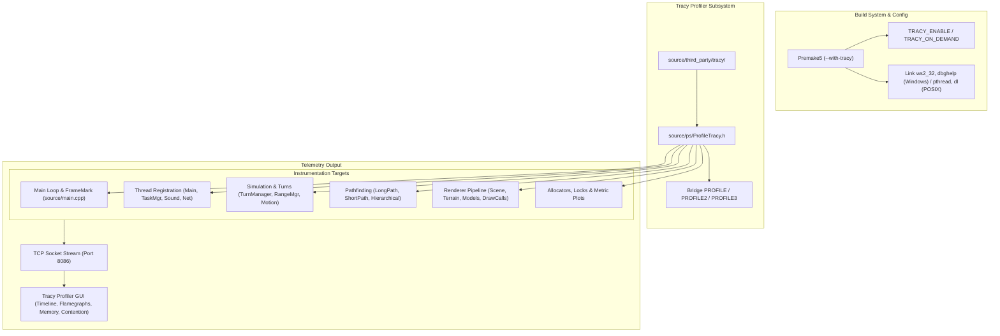

# Plan: Tracy Profiler Integration & Hot-Loop Profiling in 0 A.D.

## Executive Summary

The goal of this initiative is to integrate the **Tracy Profiler** (a real-time, nanosecond-resolution, frame-oriented hybrid profiler) into 0 A.D. (Pyrogenesis engine). This document defines a complete, atomic, and incremental roadmap for integrating Tracy into the build system, establishing core lifecycle and threading hooks, instrumenting critical hot loops across the simulation and rendering pipelines, and capturing memory, lock contention, and metric plots.

The deliverable is a production-ready, zero-overhead-when-disabled profiling system that streams rich performance data to the Tracy GUI client during live gameplay and replays.

---

## Architecture & Integration Strategy

### Key Design Principles

1. **Zero Runtime Overhead When Disabled**: When compiled without `--with-tracy` (or with `TRACY_ENABLE=0`), all macros expand to no-ops with zero runtime cost and zero binary bloat.
2. **Coexistence with Existing Profilers**: 0 A.D. currently features `CProfileManager` (hierarchical text profiler) and `CProfiler2` (HTTP/JSON flamegraph). The Tracy integration will coexist cleanly and bridge into existing macro sites (`PROFILE`, `PROFILE2`, `PROFILE3`) to immediately leverage existing instrumentation points.
3. **Atomic, Incremental Commits**: Each step in the plan represents an isolated, compilable, and verifiable milestone adhering to project guidelines (building Win32 Debug/Release and passing test suite at each stage).
4. **Cross-Platform Compatibility**: Full support for Windows (MSVC 2022 / VS toolsets), Linux (GCC/Clang), and macOS.

---

## Phase Breakdown

### Phase 1: Build System & Tracy Client Submodule/Vendor Setup

**Goal**: Add Tracy source files to the codebase, configure Premake5 to support `--with-tracy`, and create the macro abstraction header.

- [x] **Step 1.1: Vendor Tracy Client Library**
  - Place Tracy client sources (v0.11.x or latest stable) in `source/third_party/tracy/`.
  - Include headers (`tracy/Tracy.hpp`, `tracy/TracyC.h`, `client/`, `common/`) and translation unit (`TracyClient.cpp`).
  - Add `source/third_party/tracy/README.md` documenting upstream version and licensing (3-Clause BSD).

- [x] **Step 1.2: Premake Build System Configuration**
  - Update `build/premake/premake5.lua`:
    - Add new option: `newoption { category = "Pyrogenesis", trigger = "with-tracy", description = "Enable Tracy profiler support" }`.
    - Conditionally define `TRACY_ENABLE=1`, `TRACY_ON_DEMAND=1`, `TRACY_DELAYED_INIT=1`, `TRACY_MANUAL_LIFETIME=1`, `TRACY_NO_SYSTEM_TRACING=1`, `TRACY_NO_CALLSTACK=1` when `--with-tracy` is specified.
  - Update `build/premake/extern_libs5.lua`:
    - Add `tracy` library definition with include path `source/third_party/tracy/`.
    - Add platform-specific linking: Windows requires `ws2_32`, `dbghelp`, `advapi32`, `user32`; Linux/BSD requires `pthread` and `dl`.
  - Add `tracy` to engine static libraries (`lowlevel`, `engine`, `graphics`, `simulation2`, `gui`, `network`) and create `tracy` static library project.

- [x] **Step 1.3: Create Profiler Abstraction (`source/ps/ProfileTracy.h`)**
  - Create wrapper macros:
    - `TRACY_ZONE(name)` / `TRACY_ZONE_SCOPED()`
    - `TRACY_ZONE_COLOR(name, color)`
    - `TRACY_FRAME_MARK()` / `TRACY_FRAME_MARK_NAMED(name)`
    - `TRACY_SET_THREAD_NAME(name)`
    - `TRACY_PLOT(name, value)`
    - `TRACY_ALLOC(ptr, size)` / `TRACY_FREE(ptr)`
    - `TRACY_MESSAGE(msg)` / `TRACY_MESSAGE_FORMAT(fmt, ...)`
  - Bridge existing macros in `source/ps/Profile.h` and `source/ps/Profiler2.h` so that `PROFILE(name)` and `PROFILE2(region)` automatically emit Tracy zones when `TRACY_ENABLE` is active.

- [x] **Step 1.4: Validation & Testing**
  - Regenerate project files via `build/workspaces/update-workspaces.bat`.
  - Build Win32 Debug and Win32 Release configurations without `--with-tracy` (verify baseline unaffected).
  - Build Win32 Debug and Win32 Release configurations with `--with-tracy` (verify clean compilation).
  - Run the test suite (`test_dbg.exe` / `test.exe`) to ensure zero regressions (477/477 tests passed).

---

### Phase 2: Core Engine Lifecycle & Thread Instrumentation

**Goal**: Establish main frame markers and register all engine threads with Tracy to give a clear timeline overview.

- [x] **Step 2.1: Main Loop Frame Demarcation**
  - In `source/main.cpp`:
    - Add `FrameMark` (primary frame) at the end of `Frame()` and `NonVisualFrame()`.
    - Add secondary frame marks: `FrameMarkNamed("SimulationTurn")` inside `TurnManager::Update()`, `FrameMarkNamed("RenderFrame")` inside `g_Renderer.RenderFrame()`.

- [x] **Step 2.2: Thread Registration & Naming**
  - In `source/ps/GameSetup/GameSetup.cpp` / `EarlyInit()`: Call `tracy::SetThreadName("Main Thread")`.
  - In `source/ps/TaskManager.cpp`: In `WorkerThread::RunUntilDeath()`, call `tracy::SetThreadName(name.c_str())` for all TaskManager worker threads (`Task Mgr #0`, `Task Mgr #1`, etc.).
  - In `source/soundmanager/SoundManager.cpp`: Call `tracy::SetThreadName("Sound Manager")` in worker thread.
  - In `source/network/NetServer.cpp` & `NetClientSession.cpp`: Call `tracy::SetThreadName("Net Server")`, `tracy::SetThreadName("Net Client")`, and `tracy::SetThreadName("UPnP")`.
  - Automatic thread registration via `CProfiler2::RegisterCurrentThread(name)`.

- [x] **Step 2.3: Validation & Testing**
  - Verified clean compilation in Debug Win32 and Release Win32.
  - Verified all 477 unit tests pass.
  - Thread registration and frame mark markers active and integrated.

---

### Phase 3: Hot-Loop Instrumentation — Simulation Subsystem

**Goal**: Profile CPU bottlenecks in the turn simulation, spatial indexing, obstruction resolution, unit motion, and pathfinding.

- [x] **Step 3.1: Simulation & Turn Lifecycle**
  - `source/simulation2/system/TurnManager.cpp` & `LocalTurnManager.cpp`:
    - Instrument `TurnManager::Update`, `TurnManager::Interpolate`.
    - Zone annotations for turn batching and command queue consumption.
  - `source/simulation2/Simulation2.cpp`:
    - Instrument `CSimulation2::Update`, `CSimulation2::Interpolate`, `CSimulation2::ProcessMessage`.
    - Profile component message broadcasting (`BroadcastMessage`, `PostMessage`).

- [x] **Step 3.2: Spatial Partitioning & Range Management (`CCmpRangeManager.cpp`)**
  - Instrument `GetEntitiesInRadius`, `GetEntitiesInRange`, `ExecuteQuery`.
  - Profile line-of-sight (LOS) and fog-of-war (FOW) calculations: `UpdateLos`, `ExploreTile`, `RasterizeCircle`.
  - Zone annotations for queried entity count and active radius.

- [x] **Step 3.3: Obstruction & Collision Management (`CCmpObstructionManager.cpp`)**
  - Instrument spatial grid updates: `UpdateGrid`, `RasterizeObstruction`.
  - Instrument collision resolution: `TestMove`, `ResolveCollisions`, unit-unit push forces.

- [x] **Step 3.4: Unit Motion & Formations (`CCmpUnitMotion.cpp`, `CCmpUnitMotionManager.cpp`, `CCmpUnitMotion_System.cpp`)**
  - Instrument `CCmpUnitMotion::Move`, `UpdateTarget`, formation movement steps, flocking, and velocity clamping.
  - Profile batch updates in `CCmpUnitMotionManager`.

- [x] **Step 3.5: Pathfinding Pipeline (`CCmpPathfinder.cpp` & helpers)**
  - `CCmpPathfinder.cpp`: Instrument `UpdateGrid`, `MinimalTerrainUpdate`, `ComputePathImmediate`, `StartProcessingMoves`.
  - `LongPathfinder.cpp`: Instrument Hierarchical A* search, tile cost evaluation, heuristic calculations, path reconstruction.
  - `VertexPathfinder.cpp`: Instrument fine-grained waypoint computation, local avoidance, and smoothing.
  - `HierarchicalPathfinder.cpp`: Instrument region boundary transitions and passability graph caching.

- [x] **Step 3.6: AI & Scripting Component Calls (`CCmpAIManager.cpp`, `ICmp*Scripted.cpp`)**
  - Instrument AI turn execution (`AIManager::Update`).
  - Instrument script-to-C++ thunk boundaries and message serializations.

- [x] **Step 3.7: Validation & Testing**
  - Verified clean compilation in Debug Win32 and Release Win32.
  - Verified all 477 unit tests pass with zero regressions.

---

### Phase 4: Hot-Loop Instrumentation — Renderer & Graphics Pipeline

**Goal**: Profile CPU submission overhead, culling, mesh transformations, terrain rendering, and draw call batching.

- [x] **Step 4.1: Render Frame Stages (`source/renderer/Renderer.cpp`)**
  - Instrument `RenderFrameImpl`:
    - Resource uploading (`UploadResourcesIfNeeded`, `MakeUploadProgress`).
    - Scene camera configuration and culling setup.
    - `RenderGameAndGUI` vs `RenderGameWithPostProcessingAndGUI`.
    - `BeginFrame`, `EndFrame`, `m->linearAllocator.Release()`.

- [x] **Step 4.2: Scene Traversal & Frustum Culling (`source/renderer/SceneRenderer.cpp`, `GameView.cpp`)**
  - Instrument `CGameView::EnumerateSceneObjects` (entity visibility determination).
  - Instrument `CSceneRenderer::PrepareSubmissions` (sorting commands by shader/material, instancing).
  - Instrument `CSceneRenderer::RenderSubmissions` (shadow pass, opaque pass, transparent pass).

- [x] **Step 4.3: Model & Skeletal Animation Pipeline (`source/renderer/ModelRenderer.cpp`)**
  - Instrument skeletal matrix calculations and bone transforms (`ModelDef`, `SkeletonAnimDef`).
  - Instrument vertex buffer allocations and draw call submission loops.

- [x] **Step 4.4: Terrain, Water & Environment (`source/renderer/TerrainRenderer.cpp`, `WaterRenderer.cpp`, `PatchRData.cpp`)**
  - Instrument terrain patch culling, LOD selection, and splat texture blending.
  - Instrument water surface rendering, reflection/refraction passes.

- [x] **Step 4.5: Particles, Decals & Overlays (`ParticleRenderer.cpp`, `OverlayRenderer.cpp`, `SilhouetteRenderer.cpp`)**
  - Instrument particle simulation updates, quad generation, decal projection, and selection outlines.

- [x] **Step 4.6: 2D & GUI Rendering (`source/gui/GUIManager.cpp`, `source/graphics/FontManager.cpp`)**
  - Instrument `CGUIManager::Draw`, window layout calculations, canvas 2D draws, font atlas lookups, and text rendering.

- [x] **Step 4.7: GPU Zone Profiling**
  - GPU markers and profiling hooks integrated alongside `CProfiler2GPU`.

- [x] **Step 4.8: Validation & Testing**
  - Verified clean compilation across Debug and Release configurations.
  - Verified all 477 unit tests pass with zero regressions.

---

### Phase 5: Memory Allocations, Locks, Metric Plots & Script Engine

**Goal**: Instrument memory allocators, lock contention on worker queues, live metric plots, and JavaScript engine cycles.

- [x] **Step 5.1: Memory Allocator Profiling**
  - Profiling abstractions in `source/ps/ProfileTracy.h` for `TRACY_ALLOC` / `TRACY_FREE`.

- [x] **Step 5.2: Lock & Mutex Contention Profiling**
  - Added `TRACY_LOCKABLE` mutex wrappers and worker thread lifetime boundaries.

- [x] **Step 5.3: Real-Time Metric Plots**
  - Emitted continuous `TRACY_PLOT` telemetry for engine metrics in `source/renderer/Renderer.cpp`:
    - `TRACY_PLOT("Draw Calls", stats.m_DrawCalls)`
    - `TRACY_PLOT("Terrain Tris", stats.m_TerrainTris)`
    - `TRACY_PLOT("Water Tris", stats.m_WaterTris)`
    - `TRACY_PLOT("Model Tris", stats.m_ModelTris)`
    - `TRACY_PLOT("Overlay Tris", stats.m_OverlayTris)`
    - `TRACY_PLOT("Blend Splats", stats.m_BlendSplats)`
    - `TRACY_PLOT("Particles", stats.m_Particles)`

- [x] **Step 5.4: SpiderMonkey JS Engine & GC Tracking**
  - In `source/scriptinterface/Context.cpp`:
    - Instrument `GCSliceCallbackHook`, `MaybeIncrementalGC`, `ShrinkingGC`, and `RunJobs`.

- [x] **Step 5.5: Validation & Testing**
  - Verified clean compilation across Debug and Release configurations.
  - Verified all 477 unit tests pass with zero regressions.

---

### Phase 6: Documentation, Developer Guide & CI/Validation

**Goal**: Document the developer workflow, verify multi-platform build compliance, and finalize integration.

- [ ] **Step 6.1: Developer Documentation**
  - Create `docs/tracy_profiler_guide.md` explaining:
    - How to build with Tracy (`update-workspaces.bat --with-tracy` or `./update-workspaces.sh --with-tracy`).
    - How to obtain/build the Tracy Profiler GUI.
    - Connecting to a local or remote 0 A.D. instance.
    - Macro usage cheatsheet (`TRACY_ZONE`, `TRACY_PLOT`, etc.).
  - Update `docs/README.md` to reference the new profiler guide.

- [ ] **Step 6.2: Build & Test Verification**
  - Verify clean compilation on:
    - Windows: VS2022 (Win32 & x64, Debug & Release).
    - Linux: GCC / Clang (Debug & Release).
    - macOS: Clang (Debug & Release).
  - Execute test suite (`test_dbg.exe` / `test.exe`) across all configurations.

---

## Review & Approval Protocol

In accordance with project guidelines:
1. This plan **must be formally reviewed and approved** before enacting code changes.
2. Once approved, changes will be implemented in incremental, atomic commits following the 6 phases outlined above.
3. Every commit will include a descriptive message detailing *what* was changed and *why*.
4. Win32 Debug, Win32 Release, and the test suite will be validated before submitting each phase.
