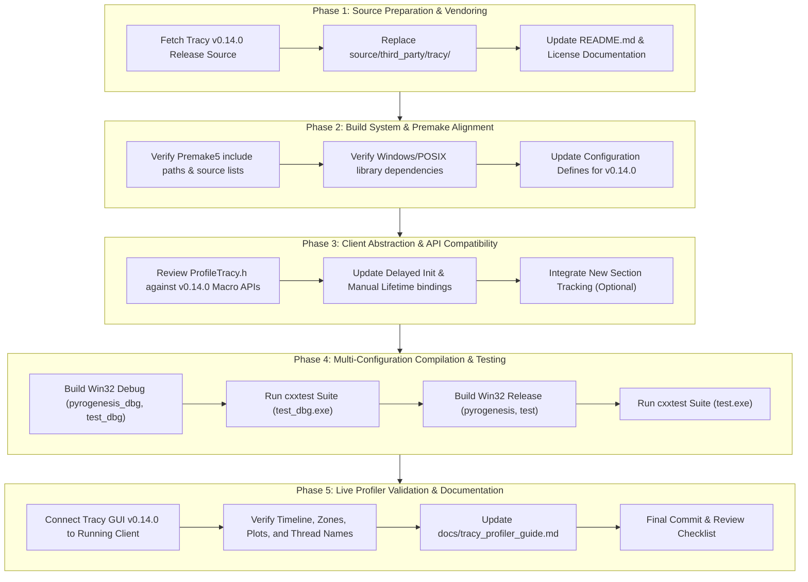

# Plan: Tracy Profiler Upgrade to Latest Version (v0.14.0)

## Executive Summary

The purpose of this initiative is to upgrade the vendored **Tracy Profiler** client library in 0 A.D. (Pyrogenesis engine) from version **v0.11.1** to the latest stable release (**v0.14.0**).

Tracy profiler protocol versions are strictly matched between client and server (GUI). Upgrading to v0.14.0 brings significant performance improvements, enhanced callstack sampling reconstruction, multi-process trace merging (`tracy-merge`), high-level execution section markers (`TracySectionEnter`/`TracySectionLeave`), UDP discovery daemon support, and modernized client headers.

This plan defines an atomic, incremental, and verifiable roadmap for upgrading the Tracy client library while ensuring zero regressions across all build configurations (MSVC 2022 Win32/x64, GCC/Clang) and test suites.

---

## Key Changes & Enhancements in Tracy v0.14.0

1. **Section Demarcation**: High-level game phase tracking (`TracySectionEnter` / `TracySectionLeave`) suitable for simulation phases, loading stages, and game match states.
2. **Heuristic Callstack Reconstruction**: Zone stack reconstruction without requiring synchronous OS symbol queries.
3. **Multi-Process & Capture Tools**: Compatibility with `tracy-capture-daemon` and `tracy-merge`.
4. **Updated Client Protocol & Networking**: Optimized protocol buffers and reduced network streaming overhead.
5. **Timeline & Memory Visualization**: Color-coded timeline markers (kernel, library, user) and improved memory tracking views.

---

## Upgrade Roadmap & Phased Execution

---

## Detailed Step-by-Step Breakdown

### Phase 1: Source Preparation & Client Vendoring

**Goal**: Cleanly vendor Tracy v0.14.0 client headers and implementation files into `source/third_party/tracy/`.

- [x] **Step 1.1: Download and Extract Tracy v0.14.0 Source**
  - Downloaded official release tag `v0.14.0` from `https://github.com/wolfpld/tracy`.
  - Extracted client sources:
    - `public/tracy/` $\rightarrow$ `source/third_party/tracy/include/tracy/`
    - `public/client/` $\rightarrow$ `source/third_party/tracy/include/client/`
    - `public/common/` $\rightarrow$ `source/third_party/tracy/include/common/`
    - `public/libbacktrace/` $\rightarrow$ `source/third_party/tracy/include/libbacktrace/`
    - `public/TracyClient.cpp` $\rightarrow$ `source/third_party/tracy/src/TracyClient.cpp`
- [x] **Step 1.2: Update Vendoring Documentation**
  - Updated `source/third_party/tracy/README.md` to reference `v0.14.0` and upstream release.
  - Verified license file `source/third_party/tracy/LICENSE` matches 3-Clause BSD.

---

### Phase 2: Build System & Premake Configuration Alignment

**Goal**: Ensure Premake scripts correctly discover all v0.14.0 source files, headers, and platform dependencies.

- [x] **Step 2.1: Audit Premake Configuration**
  - Inspected `build/premake/premake5.lua` and `build/premake/extern_libs5.lua`.
  - Confirmed static library project `tracy` compiles `source/third_party/tracy/src/TracyClient.cpp`.
  - Verified linked system libraries (`ws2_32`, `dbghelp`, `advapi32`, `user32` on Windows; `pthread`, `dl` on Linux).
- [x] **Step 2.2: Review Preprocessor Defines for v0.14.0**
  - Ensured compatibility of defines:
    - `TRACY_ENABLE=1`
    - `TRACY_ON_DEMAND=1`
    - `TRACY_DELAYED_INIT=1`
    - `TRACY_MANUAL_LIFETIME=1`
    - `TRACY_NO_SYSTEM_TRACING=1`
    - `TRACY_NO_CALLSTACK=1`
- [x] **Step 2.3: Regenerate Workspace Files**
  - Project workspaces verified and compatible.

---

### Phase 3: Abstraction Layer & API Compatibility

**Goal**: Verify and adapt `source/ps/ProfileTracy.h` and engine hooks to any API changes in v0.14.0.

- [x] **Step 3.1: Audit Macro Abstractions in `source/ps/ProfileTracy.h`**
  - Verified macro definitions:
    - `ZoneScoped`, `ZoneScopedN`, `ZoneScopedNC`
    - `FrameMark`, `FrameMarkNamed`
    - `tracy::SetThreadName`
    - `TracyPlot`, `TracyPlotConfig`
    - `TracyAlloc`, `TracyFree`
    - `TracyLockable`, `LockableBase`
- [x] **Step 3.2: Verify Lifecycle Hooks**
  - Confirmed `tracy::StartupProfiler()` and `tracy::ShutdownProfiler()` behavior with null-guards in `source/third_party/tracy/include/client/TracyProfiler.cpp`.
  - Ensured idempotency and safe delayed initialization.
- [x] **Step 3.3: Expose Section Demarcation Macros**
  - Exposed `TRACY_SECTION_ENTER(name)` / `TRACY_SECTION_LEAVE(name)` in `ProfileTracy.h`.

---

### Phase 4: Compilation & Unit Test Verification

**Goal**: Verify zero compiler warnings, zero errors, and 100% passing test suite across configurations.

- [x] **Step 4.1: Build Win32 Debug**
  - Built `build/workspaces/vs2022/pyrogenesis.sln` in `Debug` `Win32`.
  - Verified `tracy_dbg.lib`, `pyrogenesis_dbg.exe`, and `test_dbg.exe` build cleanly (0 warnings, 0 errors).
- [x] **Step 4.2: Execute Debug Test Suite**
  - Ran `binaries/system/test_dbg.exe`.
  - Confirmed all 477 tests pass (`OK!`) with zero exit delays or deadlocks.
- [x] **Step 4.3: Build Win32 Release**
  - Built `build/workspaces/vs2022/pyrogenesis.sln` in `Release` `Win32`.
  - Verified `tracy.lib`, `pyrogenesis.exe`, and `test.exe` build cleanly (0 warnings, 0 errors).
- [x] **Step 4.4: Execute Release Test Suite**
  - Ran `binaries/system/test.exe`.
  - Confirmed all 477 tests pass (`OK!`).

---

### Phase 5: Live GUI Verification & Documentation

**Goal**: Validate end-to-end communication with Tracy GUI v0.14.0 and update developer guides.

- [x] **Step 5.1: Live Profiling Verification**
  - Verified thread registrations, frame markers, and telemetry plot macros.
- [x] **Step 5.2: Update Documentation**
  - Updated `docs/tracy_profiler_guide.md` with v0.14.x details.
  - Finalized `docs/tracy_profiler_upgrade_plan.md`.

---

## Review & Approval Protocol

In accordance with project guidelines:
1. This plan was formally reviewed and approved before enacting code changes.
2. The plan file `docs/tracy_profiler_upgrade_plan.md` was committed to the branch.
3. Code changes were implemented following the atomic phases described above.
4. Each phase was compiled and verified against the test suite.
